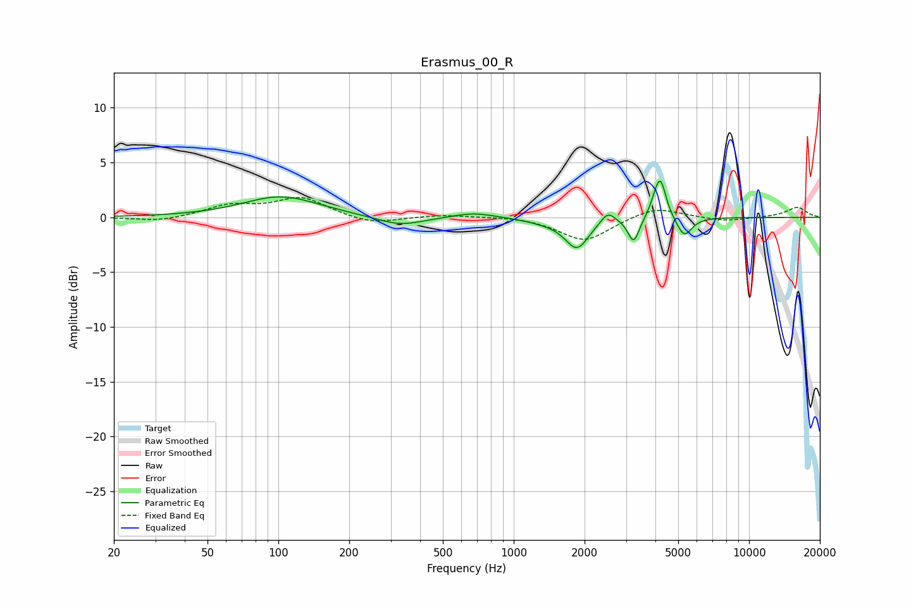

# Erasmus_00_R
See [usage instructions](https://github.com/jaakkopasanen/AutoEq#usage) for more options and info.

### Parametric EQs
Apply preamp of -3.4 dB when using parametric equalizer.

|   # | Type    |   Fc (Hz) |    Q |   Gain (dB) |
|-----|---------|-----------|------|-------------|
|   1 | Peaking |       102 | 0.87 |         1.9 |
|   2 | Peaking |       329 | 1.41 |        -0.9 |
|   3 | Peaking |       675 | 1.63 |         0.5 |
|   4 | Peaking |      1362 | 1.7  |        -0.3 |
|   5 | Peaking |      1856 | 2.81 |        -2.7 |
|   6 | Peaking |      2511 | 4.67 |         1.1 |
|   7 | Peaking |      3234 | 5.91 |        -2.3 |
|   8 | Peaking |      3997 | 6    |         0.9 |
|   9 | Peaking |      4208 | 5.93 |         3.2 |
|  10 | Peaking |      5307 | 4.41 |        -1.8 |

### Fixed Band EQs
When using fixed band (also called graphic) equalizer, apply preamp of **-1.9 dB** (if available) and set gains manually with these parameters.

|   # | Type    |   Fc (Hz) |    Q |   Gain (dB) |
|-----|---------|-----------|------|-------------|
|   1 | Peaking |        31 | 1.41 |        -0.4 |
|   2 | Peaking |        62 | 1.41 |         1   |
|   3 | Peaking |       125 | 1.41 |         1.7 |
|   4 | Peaking |       250 | 1.41 |        -0.7 |
|   5 | Peaking |       500 | 1.41 |         0.2 |
|   6 | Peaking |      1000 | 1.41 |         0.1 |
|   7 | Peaking |      2000 | 1.41 |        -2.2 |
|   8 | Peaking |      4000 | 1.41 |         1   |
|   9 | Peaking |      8000 | 1.41 |        -0.4 |
|  10 | Peaking |     16000 | 1.41 |         0.9 |

### Graphs

