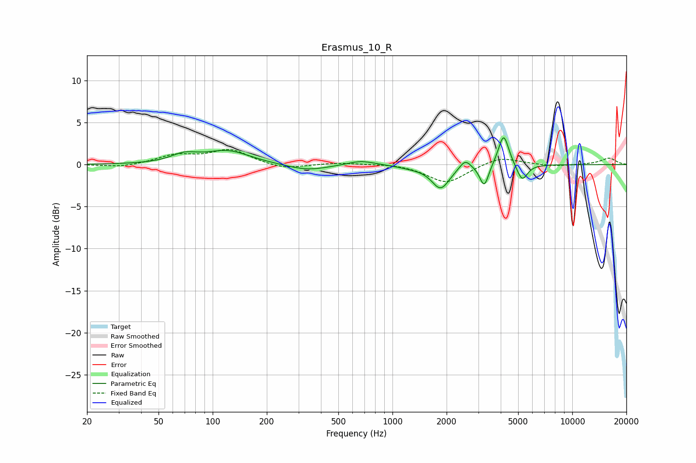

# Erasmus_10_R
See [usage instructions](https://github.com/jaakkopasanen/AutoEq#usage) for more options and info.

### Parametric EQs
Apply preamp of -3.3 dB when using parametric equalizer.

|   # | Type    |   Fc (Hz) |    Q |   Gain (dB) |
|-----|---------|-----------|------|-------------|
|   1 | Peaking |        69 | 1.94 |         0.9 |
|   2 | Peaking |       121 | 1.13 |         1.6 |
|   3 | Peaking |       336 | 1.2  |        -0.7 |
|   4 | Peaking |       668 | 1.83 |         0.6 |
|   5 | Peaking |      1288 | 1.78 |        -0.3 |
|   6 | Peaking |      1853 | 2.83 |        -2.8 |
|   7 | Peaking |      2537 | 4.74 |         1.1 |
|   8 | Peaking |      3239 | 5.75 |        -2.7 |
|   9 | Peaking |      4151 | 4.87 |         3.8 |
|  10 | Peaking |      5260 | 4.73 |        -2   |

### Fixed Band EQs
When using fixed band (also called graphic) equalizer, apply preamp of **-1.9 dB** (if available) and set gains manually with these parameters.

|   # | Type    |   Fc (Hz) |    Q |   Gain (dB) |
|-----|---------|-----------|------|-------------|
|   1 | Peaking |        31 | 1.41 |        -0.4 |
|   2 | Peaking |        62 | 1.41 |         1   |
|   3 | Peaking |       125 | 1.41 |         1.7 |
|   4 | Peaking |       250 | 1.41 |        -0.6 |
|   5 | Peaking |       500 | 1.41 |         0.2 |
|   6 | Peaking |      1000 | 1.41 |         0.2 |
|   7 | Peaking |      2000 | 1.41 |        -2.2 |
|   8 | Peaking |      4000 | 1.41 |         1   |
|   9 | Peaking |      8000 | 1.41 |        -0.2 |
|  10 | Peaking |     16000 | 1.41 |         0.8 |

### Graphs

