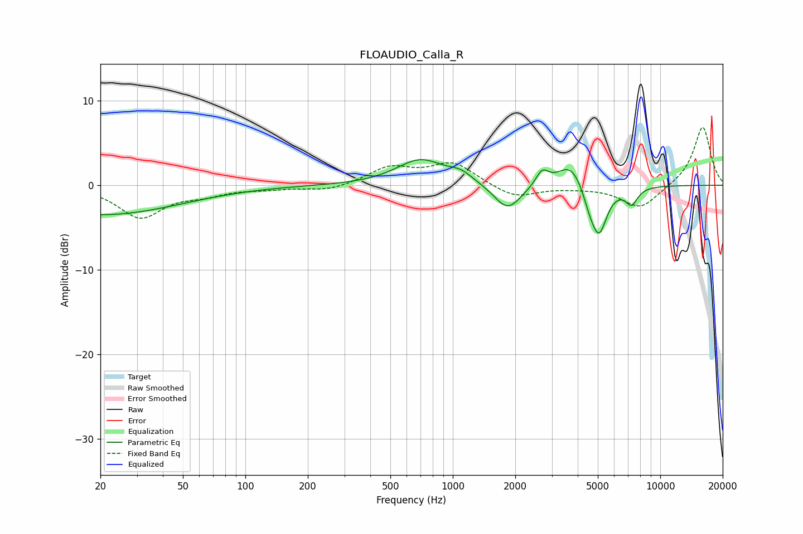

# FLOAUDIO_Calla_R
See [usage instructions](https://github.com/jaakkopasanen/AutoEq#usage) for more options and info.

### Parametric EQs
Apply preamp of -3.1 dB when using parametric equalizer.

|   # | Type    |   Fc (Hz) |    Q |   Gain (dB) |
|-----|---------|-----------|------|-------------|
|   1 | Peaking |        20 | 0.37 |        -3.5 |
|   2 | Peaking |       698 | 1.22 |         3   |
|   3 | Peaking |      1092 | 2.62 |         0.8 |
|   4 | Peaking |      1109 | 1.5  |         0.2 |
|   5 | Peaking |      1838 | 2.14 |        -3.2 |
|   6 | Peaking |      2698 | 4.54 |         1.8 |
|   7 | Peaking |      3704 | 2.24 |         2.9 |
|   8 | Peaking |      4554 | 4.4  |        -1.5 |
|   9 | Peaking |      5064 | 3.57 |        -5.7 |
|  10 | Peaking |      7274 | 4.61 |        -1.9 |

### Fixed Band EQs
When using fixed band (also called graphic) equalizer, apply preamp of **-6.9 dB** (if available) and set gains manually with these parameters.

|   # | Type    |   Fc (Hz) |    Q |   Gain (dB) |
|-----|---------|-----------|------|-------------|
|   1 | Peaking |        31 | 1.41 |        -3.7 |
|   2 | Peaking |        62 | 1.41 |        -0.9 |
|   3 | Peaking |       125 | 1.41 |        -0.3 |
|   4 | Peaking |       250 | 1.41 |        -0.7 |
|   5 | Peaking |       500 | 1.41 |         2   |
|   6 | Peaking |      1000 | 1.41 |         2.6 |
|   7 | Peaking |      2000 | 1.41 |        -1.5 |
|   8 | Peaking |      4000 | 1.41 |        -0.2 |
|   9 | Peaking |      8000 | 1.41 |        -2.8 |
|  10 | Peaking |     16000 | 1.41 |         7   |

### Graphs

