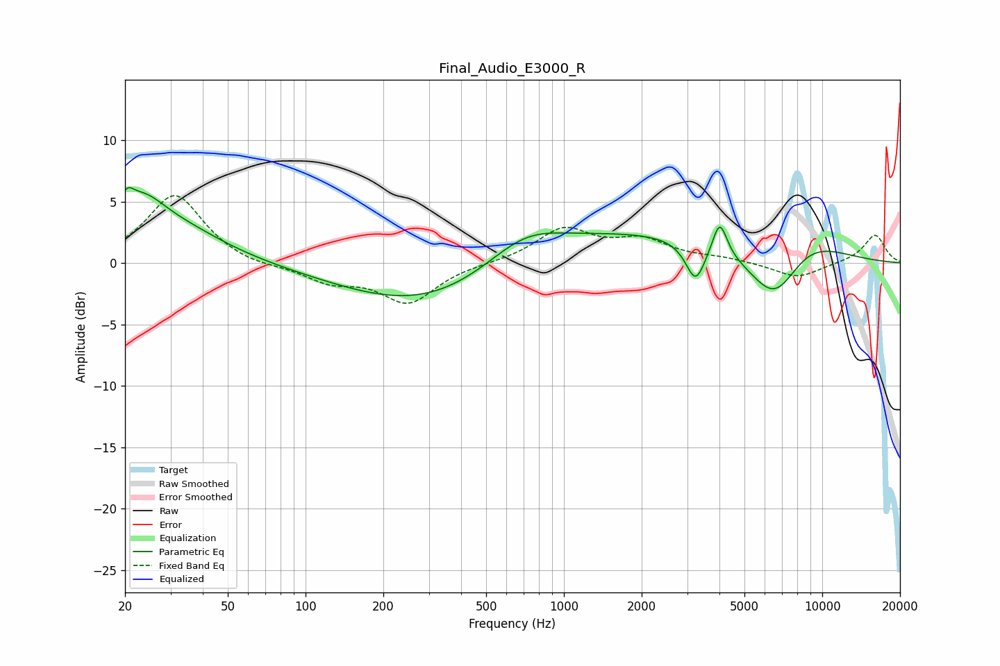

# Final_Audio_E3000_R
See [usage instructions](https://github.com/jaakkopasanen/AutoEq#usage) for more options and info.

### Parametric EQs
Apply preamp of -6.2 dB when using parametric equalizer.

|   # | Type    |   Fc (Hz) |    Q |   Gain (dB) |
|-----|---------|-----------|------|-------------|
|   1 | Peaking |        20 | 5.55 |         1.6 |
|   2 | Peaking |        23 | 1.49 |         3.8 |
|   3 | Peaking |        34 | 0.78 |         2.2 |
|   4 | Peaking |       324 | 0.42 |        -4.5 |
|   5 | Peaking |       702 | 0.95 |         2.3 |
|   6 | Peaking |      1291 | 0.24 |         2.9 |
|   7 | Peaking |      3233 | 3.76 |        -3.2 |
|   8 | Peaking |      4011 | 5.12 |         2.9 |
|   9 | Peaking |      6591 | 1.23 |        -6   |
|  10 | Peaking |      7926 | 0.85 |         3.4 |

### Fixed Band EQs
When using fixed band (also called graphic) equalizer, apply preamp of **-5.6 dB** (if available) and set gains manually with these parameters.

|   # | Type    |   Fc (Hz) |    Q |   Gain (dB) |
|-----|---------|-----------|------|-------------|
|   1 | Peaking |        31 | 1.41 |         5.6 |
|   2 | Peaking |        62 | 1.41 |        -0.4 |
|   3 | Peaking |       125 | 1.41 |        -1.4 |
|   4 | Peaking |       250 | 1.41 |        -3.2 |
|   5 | Peaking |       500 | 1.41 |         0   |
|   6 | Peaking |      1000 | 1.41 |         2.7 |
|   7 | Peaking |      2000 | 1.41 |         1.7 |
|   8 | Peaking |      4000 | 1.41 |         0.3 |
|   9 | Peaking |      8000 | 1.41 |        -1.3 |
|  10 | Peaking |     16000 | 1.41 |         2.3 |

### Graphs

