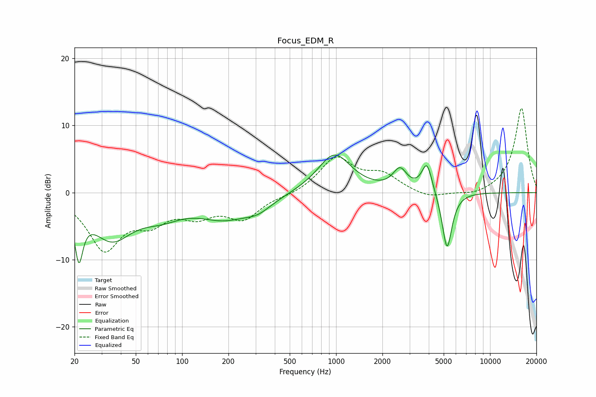

# Focus_EDM_R
See [usage instructions](https://github.com/jaakkopasanen/AutoEq#usage) for more options and info.

### Parametric EQs
Apply preamp of -5.7 dB when using parametric equalizer.

|   # | Type    |   Fc (Hz) |    Q |   Gain (dB) |
|-----|---------|-----------|------|-------------|
|   1 | Peaking |        21 | 5.51 |        -7.2 |
|   2 | Peaking |        35 | 1.05 |        -6.3 |
|   3 | Peaking |        73 | 1.03 |        -2.3 |
|   4 | Peaking |       188 | 0.82 |        -3.3 |
|   5 | Peaking |       323 | 1.63 |        -2.8 |
|   6 | Peaking |       334 | 1.85 |         1.3 |
|   7 | Peaking |       975 | 1.31 |         5.8 |
|   8 | Peaking |      2600 | 3.12 |         3   |
|   9 | Peaking |      3893 | 4.12 |         4.4 |
|  10 | Peaking |      5256 | 4.33 |        -8.8 |

### Fixed Band EQs
When using fixed band (also called graphic) equalizer, apply preamp of **-12.6 dB** (if available) and set gains manually with these parameters.

|   # | Type    |   Fc (Hz) |    Q |   Gain (dB) |
|-----|---------|-----------|------|-------------|
|   1 | Peaking |        31 | 1.41 |        -8.1 |
|   2 | Peaking |        62 | 1.41 |        -3.4 |
|   3 | Peaking |       125 | 1.41 |        -2.8 |
|   4 | Peaking |       250 | 1.41 |        -3.6 |
|   5 | Peaking |       500 | 1.41 |        -0.4 |
|   6 | Peaking |      1000 | 1.41 |         5.1 |
|   7 | Peaking |      2000 | 1.41 |         2.4 |
|   8 | Peaking |      4000 | 1.41 |        -1   |
|   9 | Peaking |      8000 | 1.41 |        -0.6 |
|  10 | Peaking |     16000 | 1.41 |        12.7 |

### Graphs

