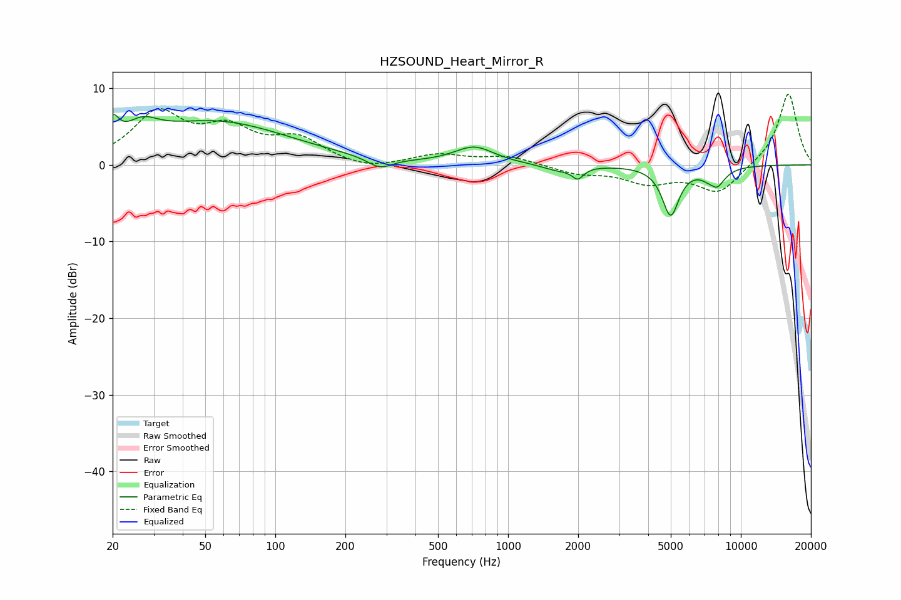

# HZSOUND_Heart_Mirror_R
See [usage instructions](https://github.com/jaakkopasanen/AutoEq#usage) for more options and info.

### Parametric EQs
Apply preamp of -6.6 dB when using parametric equalizer.

|   # | Type    |   Fc (Hz) |    Q |   Gain (dB) |
|-----|---------|-----------|------|-------------|
|   1 | Peaking |        20 | 5.43 |         3   |
|   2 | Peaking |        27 | 2.08 |         2.3 |
|   3 | Peaking |        55 | 0.44 |         5.5 |
|   4 | Peaking |       281 | 2.65 |        -1.4 |
|   5 | Peaking |       716 | 1.66 |         2.2 |
|   6 | Peaking |      1650 | 2.01 |        -0.8 |
|   7 | Peaking |      1994 | 5.89 |        -1.4 |
|   8 | Peaking |      4993 | 3.87 |        -6.4 |
|   9 | Peaking |      7583 | 5.99 |         1   |
|  10 | Peaking |      7719 | 3.58 |        -3.4 |

### Fixed Band EQs
When using fixed band (also called graphic) equalizer, apply preamp of **-9.3 dB** (if available) and set gains manually with these parameters.

|   # | Type    |   Fc (Hz) |    Q |   Gain (dB) |
|-----|---------|-----------|------|-------------|
|   1 | Peaking |        31 | 1.41 |         6.5 |
|   2 | Peaking |        62 | 1.41 |         4   |
|   3 | Peaking |       125 | 1.41 |         3.1 |
|   4 | Peaking |       250 | 1.41 |        -0.8 |
|   5 | Peaking |       500 | 1.41 |         1.3 |
|   6 | Peaking |      1000 | 1.41 |         1.1 |
|   7 | Peaking |      2000 | 1.41 |        -1   |
|   8 | Peaking |      4000 | 1.41 |        -2.1 |
|   9 | Peaking |      8000 | 1.41 |        -3.7 |
|  10 | Peaking |     16000 | 1.41 |         9.5 |

### Graphs

