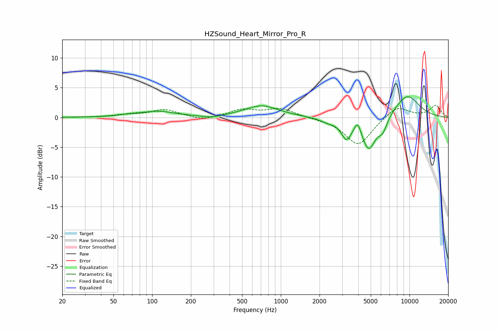

# HZSound_Heart_Mirror_Pro_R
See [usage instructions](https://github.com/jaakkopasanen/AutoEq#usage) for more options and info.

### Parametric EQs
Apply preamp of -3.6 dB when using parametric equalizer.

|   # | Type    |   Fc (Hz) |    Q |   Gain (dB) |
|-----|---------|-----------|------|-------------|
|   1 | Peaking |        67 | 1.88 |         0.2 |
|   2 | Peaking |       111 | 1.08 |         1   |
|   3 | Peaking |       289 | 2.04 |        -0.4 |
|   4 | Peaking |       709 | 1.08 |         2   |
|   5 | Peaking |      2338 | 2.19 |        -0.6 |
|   6 | Peaking |      3231 | 3.59 |        -3.1 |
|   7 | Peaking |      3958 | 5.87 |         1.9 |
|   8 | Peaking |      4830 | 2.53 |        -5.4 |
|   9 | Peaking |      6207 | 3.94 |        -2.1 |
|  10 | Peaking |      9578 | 1.26 |         3.8 |

### Fixed Band EQs
When using fixed band (also called graphic) equalizer, apply preamp of **-2.1 dB** (if available) and set gains manually with these parameters.

|   # | Type    |   Fc (Hz) |    Q |   Gain (dB) |
|-----|---------|-----------|------|-------------|
|   1 | Peaking |        31 | 1.41 |        -0   |
|   2 | Peaking |        62 | 1.41 |         0.3 |
|   3 | Peaking |       125 | 1.41 |         1.3 |
|   4 | Peaking |       250 | 1.41 |        -0.6 |
|   5 | Peaking |       500 | 1.41 |         1.3 |
|   6 | Peaking |      1000 | 1.41 |         1.4 |
|   7 | Peaking |      2000 | 1.41 |        -0.1 |
|   8 | Peaking |      4000 | 1.41 |        -4.7 |
|   9 | Peaking |      8000 | 1.41 |         2   |
|  10 | Peaking |     16000 | 1.41 |         2   |

### Graphs

