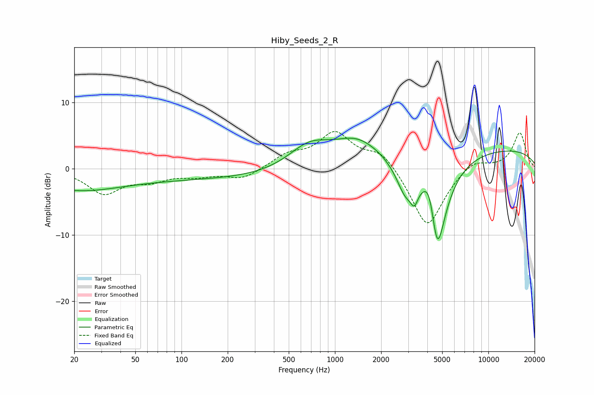

# Hiby_Seeds_2_R
See [usage instructions](https://github.com/jaakkopasanen/AutoEq#usage) for more options and info.

### Parametric EQs
Apply preamp of -4.7 dB when using parametric equalizer.

|   # | Type    |   Fc (Hz) |    Q |   Gain (dB) |
|-----|---------|-----------|------|-------------|
|   1 | Peaking |        20 | 0.5  |        -2.8 |
|   2 | Peaking |       156 | 0.2  |        -1.5 |
|   3 | Peaking |       682 | 1    |         3.7 |
|   4 | Peaking |      1383 | 0.96 |         3.4 |
|   5 | Peaking |      2226 | 4.27 |        -0.1 |
|   6 | Peaking |      2873 | 2.38 |        -4.4 |
|   7 | Peaking |      3291 | 6    |        -2.3 |
|   8 | Peaking |      4151 | 3.17 |         5.5 |
|   9 | Peaking |      4629 | 2.18 |       -16.5 |
|  10 | Peaking |      8717 | 0.18 |         3.2 |

### Fixed Band EQs
When using fixed band (also called graphic) equalizer, apply preamp of **-5.7 dB** (if available) and set gains manually with these parameters.

|   # | Type    |   Fc (Hz) |    Q |   Gain (dB) |
|-----|---------|-----------|------|-------------|
|   1 | Peaking |        31 | 1.41 |        -3.6 |
|   2 | Peaking |        62 | 1.41 |        -1.5 |
|   3 | Peaking |       125 | 1.41 |        -0.9 |
|   4 | Peaking |       250 | 1.41 |        -1.6 |
|   5 | Peaking |       500 | 1.41 |         1.9 |
|   6 | Peaking |      1000 | 1.41 |         5.2 |
|   7 | Peaking |      2000 | 1.41 |         2.7 |
|   8 | Peaking |      4000 | 1.41 |        -9.1 |
|   9 | Peaking |      8000 | 1.41 |         1.7 |
|  10 | Peaking |     16000 | 1.41 |         5.4 |

### Graphs

