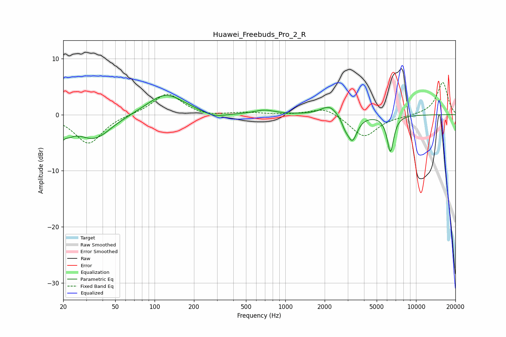

# Huawei_Freebuds_Pro_2_R
See [usage instructions](https://github.com/jaakkopasanen/AutoEq#usage) for more options and info.

### Parametric EQs
Apply preamp of -3.5 dB when using parametric equalizer.

|   # | Type    |   Fc (Hz) |    Q |   Gain (dB) |
|-----|---------|-----------|------|-------------|
|   1 | Peaking |        20 | 3.12 |        -4.4 |
|   2 | Peaking |        21 | 5.96 |         1.5 |
|   3 | Peaking |        35 | 1.1  |        -4.2 |
|   4 | Peaking |       122 | 1.01 |         3.8 |
|   5 | Peaking |       288 | 1.61 |        -0.9 |
|   6 | Peaking |       696 | 1.84 |         0.7 |
|   7 | Peaking |      2171 | 2.28 |         1.8 |
|   8 | Peaking |      2861 | 5.58 |        -1.2 |
|   9 | Peaking |      3250 | 3.68 |        -4.5 |
|  10 | Peaking |      6368 | 5.36 |        -6.5 |

### Fixed Band EQs
When using fixed band (also called graphic) equalizer, apply preamp of **-5.8 dB** (if available) and set gains manually with these parameters.

|   # | Type    |   Fc (Hz) |    Q |   Gain (dB) |
|-----|---------|-----------|------|-------------|
|   1 | Peaking |        31 | 1.41 |        -5.2 |
|   2 | Peaking |        62 | 1.41 |         0.1 |
|   3 | Peaking |       125 | 1.41 |         3.8 |
|   4 | Peaking |       250 | 1.41 |        -0.4 |
|   5 | Peaking |       500 | 1.41 |         0.4 |
|   6 | Peaking |      1000 | 1.41 |        -0   |
|   7 | Peaking |      2000 | 1.41 |         1.4 |
|   8 | Peaking |      4000 | 1.41 |        -4   |
|   9 | Peaking |      8000 | 1.41 |        -0.2 |
|  10 | Peaking |     16000 | 1.41 |         5.8 |

### Graphs

