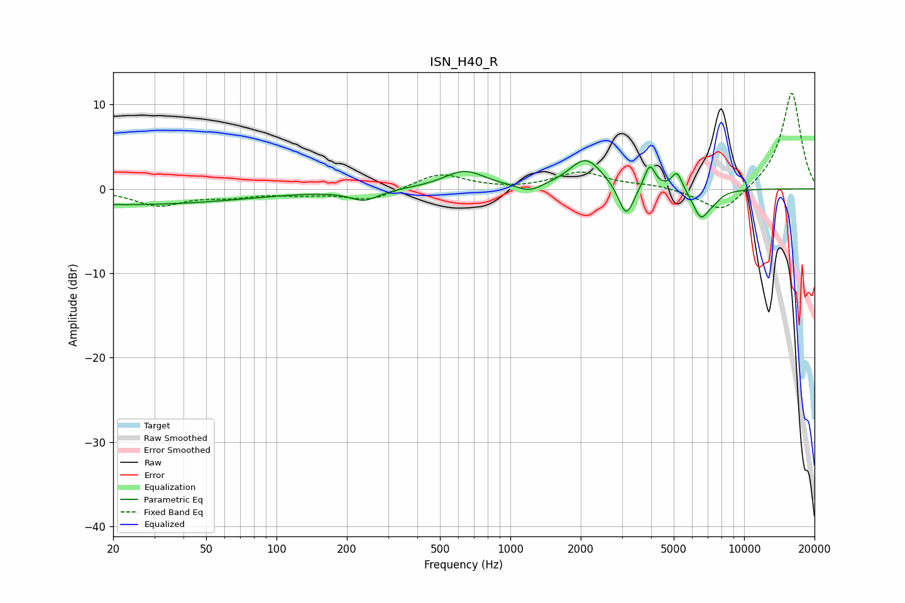

# ISN_H40_R
See [usage instructions](https://github.com/jaakkopasanen/AutoEq#usage) for more options and info.

### Parametric EQs
Apply preamp of -3.4 dB when using parametric equalizer.

|   # | Type    |   Fc (Hz) |    Q |   Gain (dB) |
|-----|---------|-----------|------|-------------|
|   1 | Peaking |        22 | 0.26 |        -1.9 |
|   2 | Peaking |       237 | 2.35 |        -1.3 |
|   3 | Peaking |       635 | 1.6  |         2.1 |
|   4 | Peaking |      1206 | 2.68 |        -0.9 |
|   5 | Peaking |      2104 | 1.98 |         3.6 |
|   6 | Peaking |      3130 | 4.4  |        -3.9 |
|   7 | Peaking |      3947 | 6    |         2.9 |
|   8 | Peaking |      5163 | 5.99 |         2.2 |
|   9 | Peaking |      6531 | 3.92 |        -3.3 |
|  10 | Peaking |      7398 | 4    |        -0.8 |

### Fixed Band EQs
When using fixed band (also called graphic) equalizer, apply preamp of **-11.4 dB** (if available) and set gains manually with these parameters.

|   # | Type    |   Fc (Hz) |    Q |   Gain (dB) |
|-----|---------|-----------|------|-------------|
|   1 | Peaking |        31 | 1.41 |        -1.9 |
|   2 | Peaking |        62 | 1.41 |        -0.8 |
|   3 | Peaking |       125 | 1.41 |        -0.5 |
|   4 | Peaking |       250 | 1.41 |        -1.4 |
|   5 | Peaking |       500 | 1.41 |         1.9 |
|   6 | Peaking |      1000 | 1.41 |        -0.1 |
|   7 | Peaking |      2000 | 1.41 |         1.9 |
|   8 | Peaking |      4000 | 1.41 |         0.4 |
|   9 | Peaking |      8000 | 1.41 |        -3   |
|  10 | Peaking |     16000 | 1.41 |        11.5 |

### Graphs

