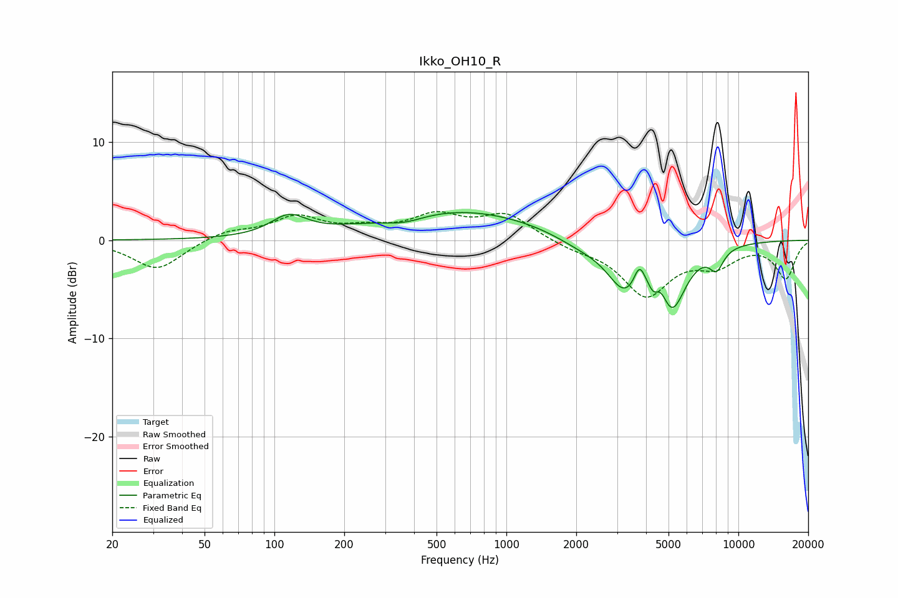

# Ikko_OH10_R
See [usage instructions](https://github.com/jaakkopasanen/AutoEq#usage) for more options and info.

### Parametric EQs
Apply preamp of -2.9 dB when using parametric equalizer.

|   # | Type    |   Fc (Hz) |    Q |   Gain (dB) |
|-----|---------|-----------|------|-------------|
|   1 | Peaking |       115 | 1.84 |         2   |
|   2 | Peaking |       363 | 1.53 |        -0.8 |
|   3 | Peaking |       612 | 0.39 |         3.1 |
|   4 | Peaking |      2075 | 1.21 |        -1   |
|   5 | Peaking |      3245 | 1.85 |        -4.5 |
|   6 | Peaking |      3744 | 5.93 |         2.2 |
|   7 | Peaking |      4309 | 6    |        -1.6 |
|   8 | Peaking |      4624 | 3.15 |         2.7 |
|   9 | Peaking |      5099 | 2.21 |        -7.5 |
|  10 | Peaking |      8049 | 4.29 |        -2   |

### Fixed Band EQs
When using fixed band (also called graphic) equalizer, apply preamp of **-3.0 dB** (if available) and set gains manually with these parameters.

|   # | Type    |   Fc (Hz) |    Q |   Gain (dB) |
|-----|---------|-----------|------|-------------|
|   1 | Peaking |        31 | 1.41 |        -3   |
|   2 | Peaking |        62 | 1.41 |         0.9 |
|   3 | Peaking |       125 | 1.41 |         2.2 |
|   4 | Peaking |       250 | 1.41 |         0.9 |
|   5 | Peaking |       500 | 1.41 |         2.3 |
|   6 | Peaking |      1000 | 1.41 |         2.5 |
|   7 | Peaking |      2000 | 1.41 |        -0.7 |
|   8 | Peaking |      4000 | 1.41 |        -5.4 |
|   9 | Peaking |      8000 | 1.41 |        -2.1 |
|  10 | Peaking |     16000 | 1.41 |        -3.8 |

### Graphs

