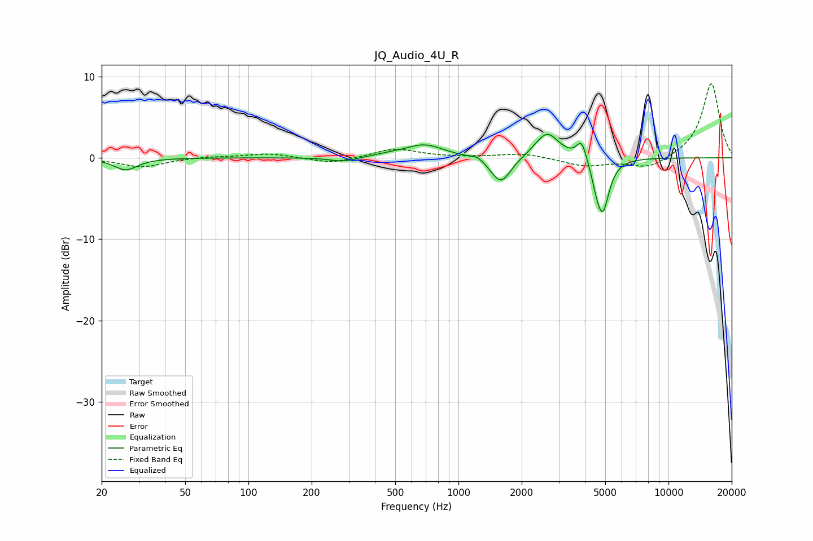

# JQ_Audio_4U_R
See [usage instructions](https://github.com/jaakkopasanen/AutoEq#usage) for more options and info.

### Parametric EQs
Apply preamp of -3.0 dB when using parametric equalizer.

|   # | Type    |   Fc (Hz) |    Q |   Gain (dB) |
|-----|---------|-----------|------|-------------|
|   1 | Peaking |        26 | 2.53 |        -1.5 |
|   2 | Peaking |       283 | 2.22 |        -0.6 |
|   3 | Peaking |       464 | 1.92 |         0.2 |
|   4 | Peaking |       688 | 1.51 |         1.6 |
|   5 | Peaking |      1234 | 4.86 |         0.5 |
|   6 | Peaking |      1591 | 2.94 |        -3.3 |
|   7 | Peaking |      2640 | 2.49 |         3.2 |
|   8 | Peaking |      3860 | 5.89 |         2.5 |
|   9 | Peaking |      4530 | 6    |        -1.3 |
|  10 | Peaking |      4861 | 4.53 |        -6.4 |

### Fixed Band EQs
When using fixed band (also called graphic) equalizer, apply preamp of **-9.2 dB** (if available) and set gains manually with these parameters.

|   # | Type    |   Fc (Hz) |    Q |   Gain (dB) |
|-----|---------|-----------|------|-------------|
|   1 | Peaking |        31 | 1.41 |        -1.1 |
|   2 | Peaking |        62 | 1.41 |         0.2 |
|   3 | Peaking |       125 | 1.41 |         0.5 |
|   4 | Peaking |       250 | 1.41 |        -0.7 |
|   5 | Peaking |       500 | 1.41 |         1.1 |
|   6 | Peaking |      1000 | 1.41 |         0   |
|   7 | Peaking |      2000 | 1.41 |         0.6 |
|   8 | Peaking |      4000 | 1.41 |        -1   |
|   9 | Peaking |      8000 | 1.41 |        -1.4 |
|  10 | Peaking |     16000 | 1.41 |         9.2 |

### Graphs

