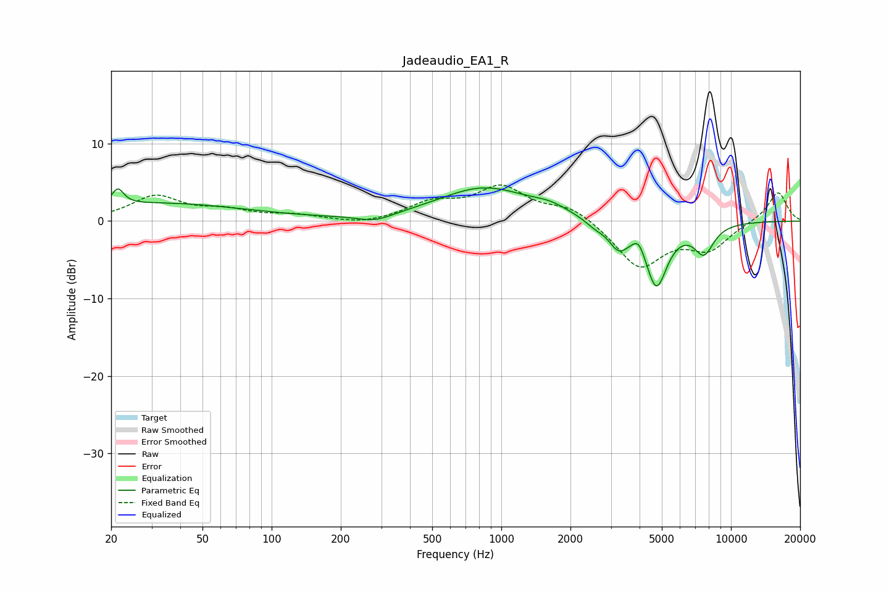

# Jadeaudio_EA1_R
See [usage instructions](https://github.com/jaakkopasanen/AutoEq#usage) for more options and info.

### Parametric EQs
Apply preamp of -4.4 dB when using parametric equalizer.

|   # | Type    |   Fc (Hz) |    Q |   Gain (dB) |
|-----|---------|-----------|------|-------------|
|   1 | Peaking |        21 | 5.72 |         2.1 |
|   2 | Peaking |        32 | 0.36 |         2.3 |
|   3 | Peaking |       283 | 1.84 |        -0.9 |
|   4 | Peaking |       844 | 0.71 |         4.3 |
|   5 | Peaking |      1628 | 1.86 |         0.8 |
|   6 | Peaking |      2557 | 3.13 |        -0.8 |
|   7 | Peaking |      3244 | 3.22 |        -3   |
|   8 | Peaking |      3970 | 5.6  |         1.5 |
|   9 | Peaking |      4735 | 2.88 |        -8.2 |
|  10 | Peaking |      7628 | 3.08 |        -3.7 |

### Fixed Band EQs
When using fixed band (also called graphic) equalizer, apply preamp of **-4.7 dB** (if available) and set gains manually with these parameters.

|   # | Type    |   Fc (Hz) |    Q |   Gain (dB) |
|-----|---------|-----------|------|-------------|
|   1 | Peaking |        31 | 1.41 |         3.1 |
|   2 | Peaking |        62 | 1.41 |         1.2 |
|   3 | Peaking |       125 | 1.41 |         0.7 |
|   4 | Peaking |       250 | 1.41 |        -0.6 |
|   5 | Peaking |       500 | 1.41 |         2.1 |
|   6 | Peaking |      1000 | 1.41 |         4.2 |
|   7 | Peaking |      2000 | 1.41 |         1.8 |
|   8 | Peaking |      4000 | 1.41 |        -5.9 |
|   9 | Peaking |      8000 | 1.41 |        -3.4 |
|  10 | Peaking |     16000 | 1.41 |         3.9 |

### Graphs

