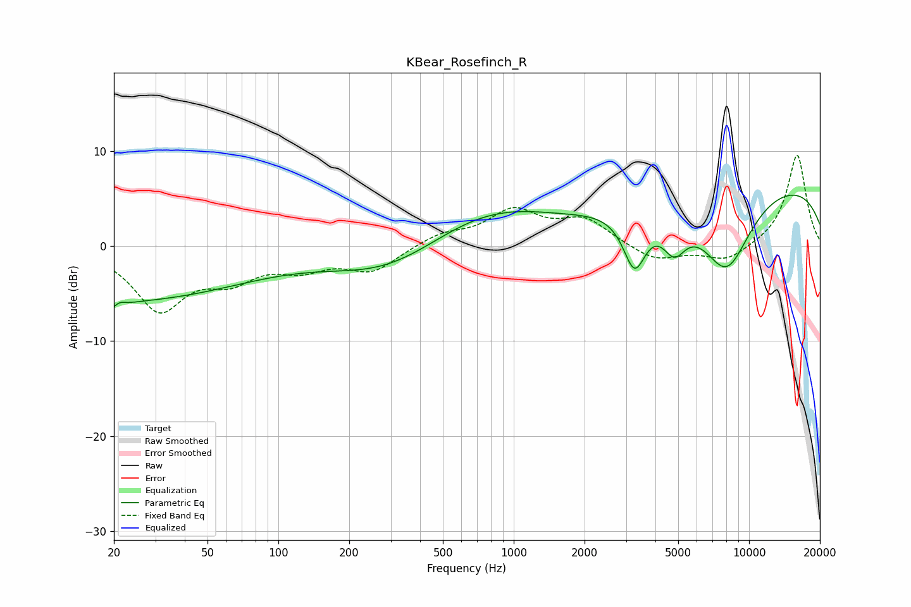

# KBear_Rosefinch_R
See [usage instructions](https://github.com/jaakkopasanen/AutoEq#usage) for more options and info.

### Parametric EQs
Apply preamp of -5.5 dB when using parametric equalizer.

|   # | Type    |   Fc (Hz) |    Q |   Gain (dB) |
|-----|---------|-----------|------|-------------|
|   1 | Peaking |        21 | 4.32 |        -4.2 |
|   2 | Peaking |        21 | 0.25 |        -5.7 |
|   3 | Peaking |        21 | 4.83 |         3.8 |
|   4 | Peaking |       287 | 0.59 |        -2.8 |
|   5 | Peaking |       706 | 0.6  |         3.1 |
|   6 | Peaking |      1095 | 0.86 |         0.7 |
|   7 | Peaking |      3263 | 2.86 |        -6   |
|   8 | Peaking |      4807 | 2.76 |        -3.7 |
|   9 | Peaking |      8004 | 1.17 |        -8.7 |
|  10 | Peaking |     10000 | 0.19 |         7.1 |

### Fixed Band EQs
When using fixed band (also called graphic) equalizer, apply preamp of **-9.7 dB** (if available) and set gains manually with these parameters.

|   # | Type    |   Fc (Hz) |    Q |   Gain (dB) |
|-----|---------|-----------|------|-------------|
|   1 | Peaking |        31 | 1.41 |        -6.4 |
|   2 | Peaking |        62 | 1.41 |        -2.9 |
|   3 | Peaking |       125 | 1.41 |        -1.9 |
|   4 | Peaking |       250 | 1.41 |        -2.5 |
|   5 | Peaking |       500 | 1.41 |         1.2 |
|   6 | Peaking |      1000 | 1.41 |         3.5 |
|   7 | Peaking |      2000 | 1.41 |         2.6 |
|   8 | Peaking |      4000 | 1.41 |        -1.6 |
|   9 | Peaking |      8000 | 1.41 |        -1.7 |
|  10 | Peaking |     16000 | 1.41 |         9.7 |

### Graphs

