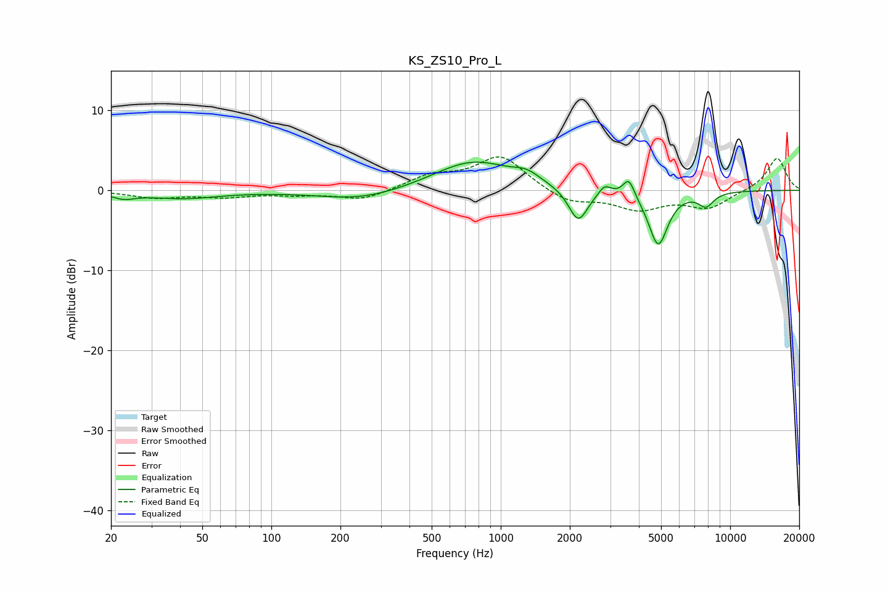

# KS_ZS10_Pro_L
See [usage instructions](https://github.com/jaakkopasanen/AutoEq#usage) for more options and info.

### Parametric EQs
Apply preamp of -3.6 dB when using parametric equalizer.

|   # | Type    |   Fc (Hz) |    Q |   Gain (dB) |
|-----|---------|-----------|------|-------------|
|   1 | Peaking |        23 | 2.9  |        -0.7 |
|   2 | Peaking |        41 | 0.88 |        -1   |
|   3 | Peaking |       248 | 0.76 |        -1.3 |
|   4 | Peaking |       759 | 0.81 |         3.7 |
|   5 | Peaking |      1297 | 2.54 |         1   |
|   6 | Peaking |      2177 | 3.33 |        -4.3 |
|   7 | Peaking |      2838 | 5.35 |         1.2 |
|   8 | Peaking |      3618 | 5.69 |         2.3 |
|   9 | Peaking |      4858 | 3.31 |        -6.8 |
|  10 | Peaking |      7851 | 3.94 |        -1.7 |

### Fixed Band EQs
When using fixed band (also called graphic) equalizer, apply preamp of **-4.3 dB** (if available) and set gains manually with these parameters.

|   # | Type    |   Fc (Hz) |    Q |   Gain (dB) |
|-----|---------|-----------|------|-------------|
|   1 | Peaking |        31 | 1.41 |        -0.9 |
|   2 | Peaking |        62 | 1.41 |        -0.7 |
|   3 | Peaking |       125 | 1.41 |        -0.4 |
|   4 | Peaking |       250 | 1.41 |        -1.2 |
|   5 | Peaking |       500 | 1.41 |         1.7 |
|   6 | Peaking |      1000 | 1.41 |         4.3 |
|   7 | Peaking |      2000 | 1.41 |        -1.6 |
|   8 | Peaking |      4000 | 1.41 |        -2.2 |
|   9 | Peaking |      8000 | 1.41 |        -2.1 |
|  10 | Peaking |     16000 | 1.41 |         4.1 |

### Graphs

