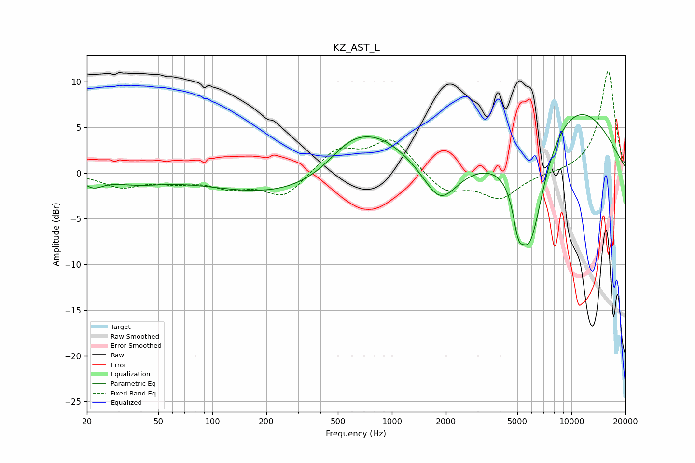

# KZ_AST_L
See [usage instructions](https://github.com/jaakkopasanen/AutoEq#usage) for more options and info.

### Parametric EQs
Apply preamp of -6.5 dB when using parametric equalizer.

|   # | Type    |   Fc (Hz) |    Q |   Gain (dB) |
|-----|---------|-----------|------|-------------|
|   1 | Peaking |        22 | 2.63 |        -1.1 |
|   2 | Peaking |        38 | 0.94 |        -0.9 |
|   3 | Peaking |       298 | 0.33 |        -2.8 |
|   4 | Peaking |       567 | 1.23 |         1.8 |
|   5 | Peaking |       804 | 0.7  |         5   |
|   6 | Peaking |      1857 | 1.49 |        -4.4 |
|   7 | Peaking |      5055 | 4.71 |        -3.8 |
|   8 | Peaking |      5703 | 3.25 |        -2.7 |
|   9 | Peaking |      6053 | 1.64 |        -9.4 |
|  10 | Peaking |      9996 | 0.44 |         7.8 |

### Fixed Band EQs
When using fixed band (also called graphic) equalizer, apply preamp of **-11.2 dB** (if available) and set gains manually with these parameters.

|   # | Type    |   Fc (Hz) |    Q |   Gain (dB) |
|-----|---------|-----------|------|-------------|
|   1 | Peaking |        31 | 1.41 |        -1.4 |
|   2 | Peaking |        62 | 1.41 |        -0.8 |
|   3 | Peaking |       125 | 1.41 |        -1.3 |
|   4 | Peaking |       250 | 1.41 |        -2.6 |
|   5 | Peaking |       500 | 1.41 |         2.6 |
|   6 | Peaking |      1000 | 1.41 |         3.7 |
|   7 | Peaking |      2000 | 1.41 |        -2.2 |
|   8 | Peaking |      4000 | 1.41 |        -2.7 |
|   9 | Peaking |      8000 | 1.41 |        -0.1 |
|  10 | Peaking |     16000 | 1.41 |        11.2 |

### Graphs

