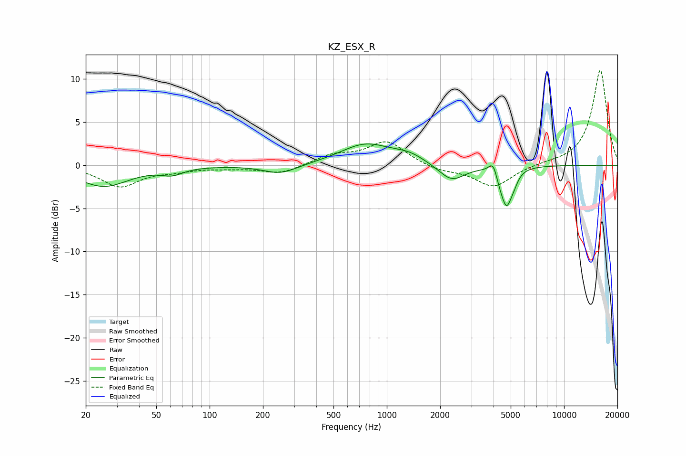

# KZ_ESX_R
See [usage instructions](https://github.com/jaakkopasanen/AutoEq#usage) for more options and info.

### Parametric EQs
Apply preamp of -2.6 dB when using parametric equalizer.

|   # | Type    |   Fc (Hz) |    Q |   Gain (dB) |
|-----|---------|-----------|------|-------------|
|   1 | Peaking |        25 | 1    |        -2.4 |
|   2 | Peaking |        62 | 2.36 |        -0.7 |
|   3 | Peaking |       251 | 1.48 |        -1.1 |
|   4 | Peaking |       758 | 0.98 |         2.4 |
|   5 | Peaking |      1332 | 1.55 |         0.9 |
|   6 | Peaking |      2320 | 1.93 |        -2   |
|   7 | Peaking |      3984 | 5.98 |         1.5 |
|   8 | Peaking |      4325 | 6    |        -0.8 |
|   9 | Peaking |      4736 | 4.55 |        -4.3 |
|  10 | Peaking |      5223 | 6    |        -0.8 |

### Fixed Band EQs
When using fixed band (also called graphic) equalizer, apply preamp of **-11.1 dB** (if available) and set gains manually with these parameters.

|   # | Type    |   Fc (Hz) |    Q |   Gain (dB) |
|-----|---------|-----------|------|-------------|
|   1 | Peaking |        31 | 1.41 |        -2.4 |
|   2 | Peaking |        62 | 1.41 |        -0.5 |
|   3 | Peaking |       125 | 1.41 |        -0.3 |
|   4 | Peaking |       250 | 1.41 |        -1   |
|   5 | Peaking |       500 | 1.41 |         1.1 |
|   6 | Peaking |      1000 | 1.41 |         2.7 |
|   7 | Peaking |      2000 | 1.41 |        -0.6 |
|   8 | Peaking |      4000 | 1.41 |        -2.5 |
|   9 | Peaking |      8000 | 1.41 |         0.2 |
|  10 | Peaking |     16000 | 1.41 |        11.1 |

### Graphs

