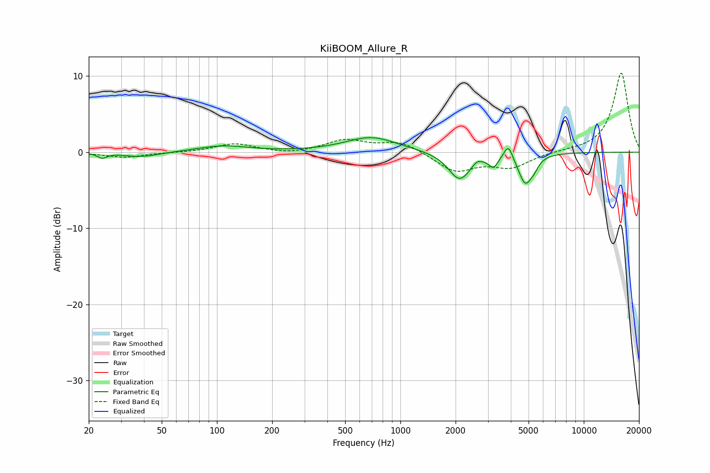

# KiiBOOM_Allure_R
See [usage instructions](https://github.com/jaakkopasanen/AutoEq#usage) for more options and info.

### Parametric EQs
Apply preamp of -2.0 dB when using parametric equalizer.

|   # | Type    |   Fc (Hz) |    Q |   Gain (dB) |
|-----|---------|-----------|------|-------------|
|   1 | Peaking |        24 | 5.85 |        -0.6 |
|   2 | Peaking |        39 | 1.43 |        -0.7 |
|   3 | Peaking |       108 | 1.02 |         0.8 |
|   4 | Peaking |       694 | 1.01 |         2   |
|   5 | Peaking |      2102 | 2.33 |        -3.6 |
|   6 | Peaking |      2616 | 6    |         0.6 |
|   7 | Peaking |      3217 | 5.77 |        -1.4 |
|   8 | Peaking |      3881 | 6    |         2   |
|   9 | Peaking |      4800 | 3.73 |        -3.9 |
|  10 | Peaking |      5372 | 6    |        -0.8 |

### Fixed Band EQs
When using fixed band (also called graphic) equalizer, apply preamp of **-10.5 dB** (if available) and set gains manually with these parameters.

|   # | Type    |   Fc (Hz) |    Q |   Gain (dB) |
|-----|---------|-----------|------|-------------|
|   1 | Peaking |        31 | 1.41 |        -0.7 |
|   2 | Peaking |        62 | 1.41 |        -0   |
|   3 | Peaking |       125 | 1.41 |         1.1 |
|   4 | Peaking |       250 | 1.41 |        -0.3 |
|   5 | Peaking |       500 | 1.41 |         1.5 |
|   6 | Peaking |      1000 | 1.41 |         1.4 |
|   7 | Peaking |      2000 | 1.41 |        -2.5 |
|   8 | Peaking |      4000 | 1.41 |        -1.9 |
|   9 | Peaking |      8000 | 1.41 |         0.1 |
|  10 | Peaking |     16000 | 1.41 |        10.5 |

### Graphs

