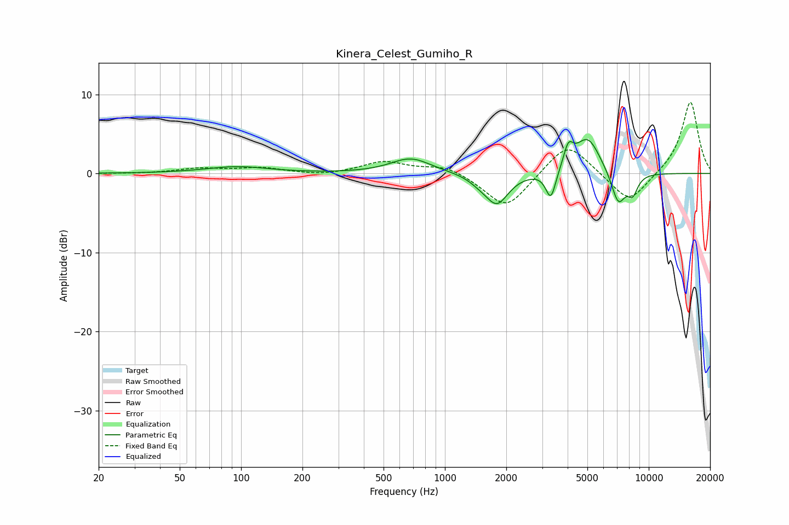

# Kinera_Celest_Gumiho_R
See [usage instructions](https://github.com/jaakkopasanen/AutoEq#usage) for more options and info.

### Parametric EQs
Apply preamp of -4.4 dB when using parametric equalizer.

|   # | Type    |   Fc (Hz) |    Q |   Gain (dB) |
|-----|---------|-----------|------|-------------|
|   1 | Peaking |        96 | 0.92 |         0.8 |
|   2 | Peaking |       680 | 1.44 |         1.9 |
|   3 | Peaking |      1471 | 2.79 |        -0.6 |
|   4 | Peaking |      1798 | 2.49 |        -3.8 |
|   5 | Peaking |      3310 | 5.68 |        -3.7 |
|   6 | Peaking |      4033 | 5.99 |         2.5 |
|   7 | Peaking |      4984 | 2.17 |         4.3 |
|   8 | Peaking |      5210 | 3.13 |         0.3 |
|   9 | Peaking |      7090 | 3.83 |        -4.1 |
|  10 | Peaking |      8333 | 5.05 |        -2.3 |

### Fixed Band EQs
When using fixed band (also called graphic) equalizer, apply preamp of **-9.1 dB** (if available) and set gains manually with these parameters.

|   # | Type    |   Fc (Hz) |    Q |   Gain (dB) |
|-----|---------|-----------|------|-------------|
|   1 | Peaking |        31 | 1.41 |        -0   |
|   2 | Peaking |        62 | 1.41 |         0.6 |
|   3 | Peaking |       125 | 1.41 |         0.7 |
|   4 | Peaking |       250 | 1.41 |        -0.3 |
|   5 | Peaking |       500 | 1.41 |         1.5 |
|   6 | Peaking |      1000 | 1.41 |         1.1 |
|   7 | Peaking |      2000 | 1.41 |        -4.6 |
|   8 | Peaking |      4000 | 1.41 |         4.2 |
|   9 | Peaking |      8000 | 1.41 |        -3.9 |
|  10 | Peaking |     16000 | 1.41 |         9.2 |

### Graphs

