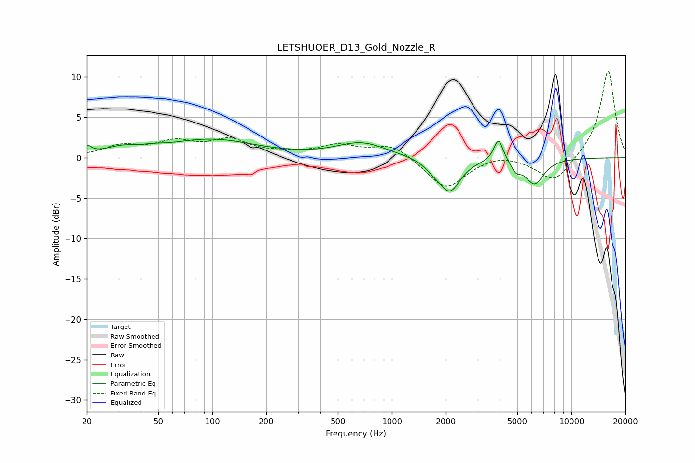

# LETSHUOER_D13_Gold_Nozzle_R
See [usage instructions](https://github.com/jaakkopasanen/AutoEq#usage) for more options and info.

### Parametric EQs
Apply preamp of -2.4 dB when using parametric equalizer.

|   # | Type    |   Fc (Hz) |    Q |   Gain (dB) |
|-----|---------|-----------|------|-------------|
|   1 | Peaking |        20 | 5.99 |         1   |
|   2 | Peaking |        31 | 1.48 |         0.9 |
|   3 | Peaking |        47 | 2.5  |         0.2 |
|   4 | Peaking |        98 | 0.57 |         2.2 |
|   5 | Peaking |       677 | 1.03 |         1.8 |
|   6 | Peaking |      1701 | 2.97 |        -0.8 |
|   7 | Peaking |      2102 | 2.4  |        -4   |
|   8 | Peaking |      3926 | 5.43 |         2.9 |
|   9 | Peaking |      4905 | 5.32 |        -1.1 |
|  10 | Peaking |      6233 | 2.63 |        -3.1 |

### Fixed Band EQs
When using fixed band (also called graphic) equalizer, apply preamp of **-10.8 dB** (if available) and set gains manually with these parameters.

|   # | Type    |   Fc (Hz) |    Q |   Gain (dB) |
|-----|---------|-----------|------|-------------|
|   1 | Peaking |        31 | 1.41 |         1.3 |
|   2 | Peaking |        62 | 1.41 |         1.7 |
|   3 | Peaking |       125 | 1.41 |         2   |
|   4 | Peaking |       250 | 1.41 |         0.4 |
|   5 | Peaking |       500 | 1.41 |         1.4 |
|   6 | Peaking |      1000 | 1.41 |         1.7 |
|   7 | Peaking |      2000 | 1.41 |        -3.9 |
|   8 | Peaking |      4000 | 1.41 |         0.6 |
|   9 | Peaking |      8000 | 1.41 |        -3.2 |
|  10 | Peaking |     16000 | 1.41 |        10.9 |

### Graphs

