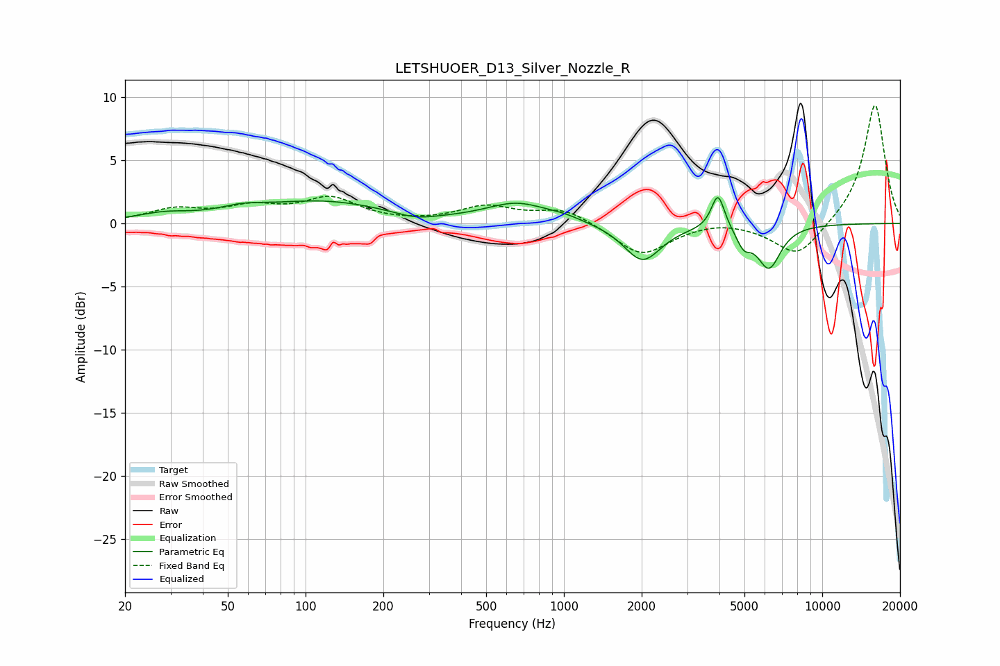

# LETSHUOER_D13_Silver_Nozzle_R
See [usage instructions](https://github.com/jaakkopasanen/AutoEq#usage) for more options and info.

### Parametric EQs
Apply preamp of -2.2 dB when using parametric equalizer.

|   # | Type    |   Fc (Hz) |    Q |   Gain (dB) |
|-----|---------|-----------|------|-------------|
|   1 | Peaking |        28 | 1.36 |         0.6 |
|   2 | Peaking |        57 | 1.56 |         0.5 |
|   3 | Peaking |       117 | 0.57 |         1.7 |
|   4 | Peaking |       267 | 1.73 |        -0.5 |
|   5 | Peaking |       658 | 1.18 |         1.5 |
|   6 | Peaking |      1003 | 1.97 |         0.3 |
|   7 | Peaking |      2014 | 1.96 |        -3   |
|   8 | Peaking |      3948 | 5.51 |         2.9 |
|   9 | Peaking |      4964 | 4.91 |        -1.3 |
|  10 | Peaking |      6218 | 3.01 |        -3.4 |

### Fixed Band EQs
When using fixed band (also called graphic) equalizer, apply preamp of **-9.4 dB** (if available) and set gains manually with these parameters.

|   # | Type    |   Fc (Hz) |    Q |   Gain (dB) |
|-----|---------|-----------|------|-------------|
|   1 | Peaking |        31 | 1.41 |         1   |
|   2 | Peaking |        62 | 1.41 |         1.1 |
|   3 | Peaking |       125 | 1.41 |         1.9 |
|   4 | Peaking |       250 | 1.41 |        -0   |
|   5 | Peaking |       500 | 1.41 |         1.3 |
|   6 | Peaking |      1000 | 1.41 |         1.2 |
|   7 | Peaking |      2000 | 1.41 |        -2.6 |
|   8 | Peaking |      4000 | 1.41 |         0.3 |
|   9 | Peaking |      8000 | 1.41 |        -2.7 |
|  10 | Peaking |     16000 | 1.41 |         9.5 |

### Graphs

