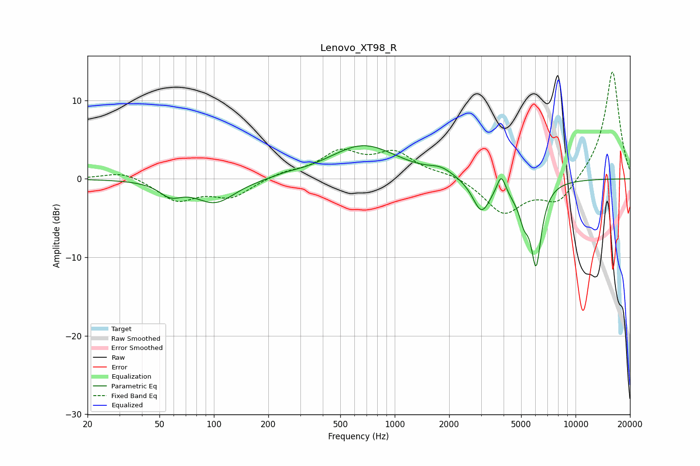

# Lenovo_XT98_R
See [usage instructions](https://github.com/jaakkopasanen/AutoEq#usage) for more options and info.

### Parametric EQs
Apply preamp of -4.3 dB when using parametric equalizer.

|   # | Type    |   Fc (Hz) |    Q |   Gain (dB) |
|-----|---------|-----------|------|-------------|
|   1 | Peaking |        57 | 2.3  |        -1.6 |
|   2 | Peaking |       102 | 1.27 |        -3   |
|   3 | Peaking |       249 | 2.34 |         0.2 |
|   4 | Peaking |       672 | 0.75 |         4.3 |
|   5 | Peaking |      1808 | 2.18 |         0.9 |
|   6 | Peaking |      3015 | 2.9  |        -4.2 |
|   7 | Peaking |      3881 | 6    |         2.4 |
|   8 | Peaking |      4816 | 2.17 |        -1.5 |
|   9 | Peaking |      5194 | 5.89 |        -2.3 |
|  10 | Peaking |      6048 | 4.7  |       -10   |

### Fixed Band EQs
When using fixed band (also called graphic) equalizer, apply preamp of **-13.7 dB** (if available) and set gains manually with these parameters.

|   # | Type    |   Fc (Hz) |    Q |   Gain (dB) |
|-----|---------|-----------|------|-------------|
|   1 | Peaking |        31 | 1.41 |         1   |
|   2 | Peaking |        62 | 1.41 |        -2.7 |
|   3 | Peaking |       125 | 1.41 |        -2.2 |
|   4 | Peaking |       250 | 1.41 |         0.7 |
|   5 | Peaking |       500 | 1.41 |         3.2 |
|   6 | Peaking |      1000 | 1.41 |         3.1 |
|   7 | Peaking |      2000 | 1.41 |         0.6 |
|   8 | Peaking |      4000 | 1.41 |        -4.3 |
|   9 | Peaking |      8000 | 1.41 |        -3.2 |
|  10 | Peaking |     16000 | 1.41 |        13.9 |

### Graphs

