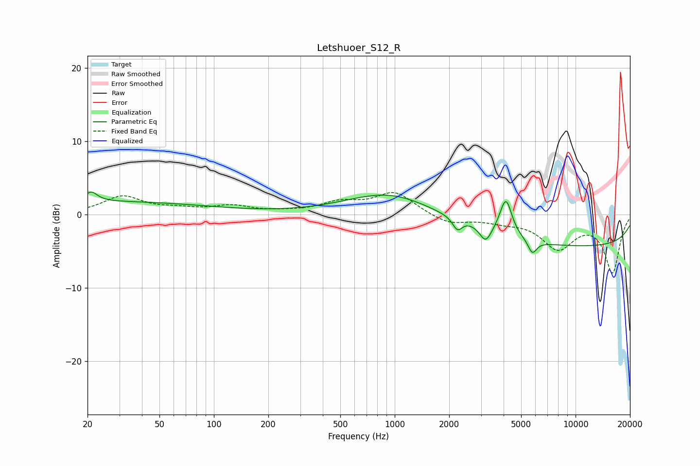

# Letshuoer_S12_R
See [usage instructions](https://github.com/jaakkopasanen/AutoEq#usage) for more options and info.

### Parametric EQs
Apply preamp of -3.1 dB when using parametric equalizer.

|   # | Type    |   Fc (Hz) |    Q |   Gain (dB) |
|-----|---------|-----------|------|-------------|
|   1 | Peaking |        21 | 4.31 |         1.3 |
|   2 | Peaking |        22 | 0.21 |         1.8 |
|   3 | Peaking |       959 | 0.59 |         3.2 |
|   4 | Peaking |      2225 | 5.09 |        -1.9 |
|   5 | Peaking |      2369 | 1.93 |         0.7 |
|   6 | Peaking |      3184 | 4.57 |        -2.1 |
|   7 | Peaking |      4106 | 4.04 |         4.8 |
|   8 | Peaking |      4194 | 6    |         0.4 |
|   9 | Peaking |      5769 | 5.79 |        -1.8 |
|  10 | Peaking |     10000 | 0.18 |        -4.3 |

### Fixed Band EQs
When using fixed band (also called graphic) equalizer, apply preamp of **-3.1 dB** (if available) and set gains manually with these parameters.

|   # | Type    |   Fc (Hz) |    Q |   Gain (dB) |
|-----|---------|-----------|------|-------------|
|   1 | Peaking |        31 | 1.41 |         2.4 |
|   2 | Peaking |        62 | 1.41 |         0.6 |
|   3 | Peaking |       125 | 1.41 |         1   |
|   4 | Peaking |       250 | 1.41 |         0.2 |
|   5 | Peaking |       500 | 1.41 |         1.5 |
|   6 | Peaking |      1000 | 1.41 |         3   |
|   7 | Peaking |      2000 | 1.41 |        -1.3 |
|   8 | Peaking |      4000 | 1.41 |        -0.7 |
|   9 | Peaking |      8000 | 1.41 |        -4.4 |
|  10 | Peaking |     16000 | 1.41 |        -7.8 |

### Graphs

