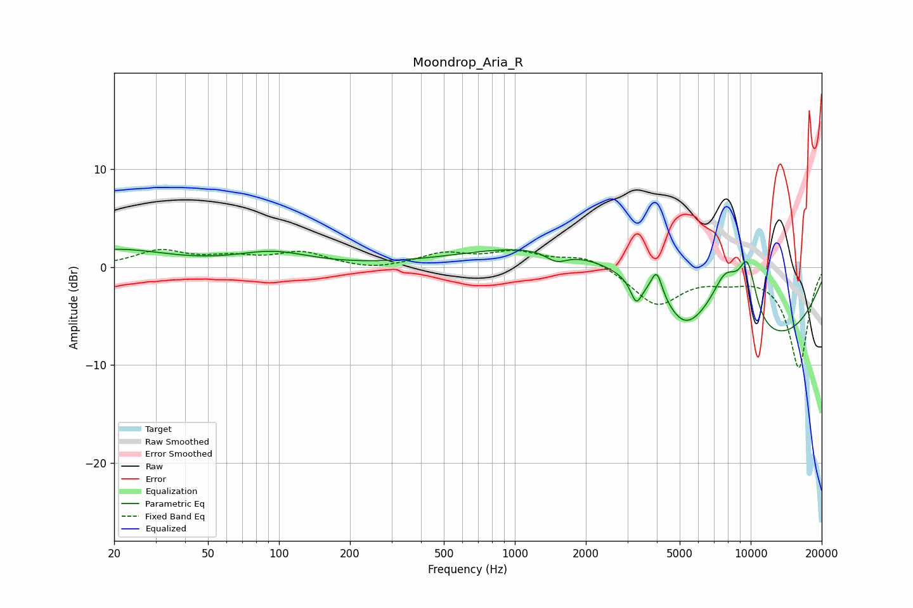

# Moondrop_Aria_R
See [usage instructions](https://github.com/jaakkopasanen/AutoEq#usage) for more options and info.

### Parametric EQs
Apply preamp of -1.9 dB when using parametric equalizer.

|   # | Type    |   Fc (Hz) |    Q |   Gain (dB) |
|-----|---------|-----------|------|-------------|
|   1 | Peaking |        20 | 0.66 |         1.7 |
|   2 | Peaking |        94 | 0.93 |         1.4 |
|   3 | Peaking |      1502 | 3.05 |        -1.1 |
|   4 | Peaking |      2257 | 0.3  |         3.5 |
|   5 | Peaking |      3272 | 6    |        -2.3 |
|   6 | Peaking |      3997 | 5.94 |         2.7 |
|   7 | Peaking |      5229 | 1.85 |        -2.6 |
|   8 | Peaking |      7840 | 2.04 |         5.2 |
|   9 | Peaking |      9692 | 3.17 |         6   |
|  10 | Peaking |      9783 | 0.28 |        -8.6 |

### Fixed Band EQs
When using fixed band (also called graphic) equalizer, apply preamp of **-1.9 dB** (if available) and set gains manually with these parameters.

|   # | Type    |   Fc (Hz) |    Q |   Gain (dB) |
|-----|---------|-----------|------|-------------|
|   1 | Peaking |        31 | 1.41 |         1.6 |
|   2 | Peaking |        62 | 1.41 |         0.8 |
|   3 | Peaking |       125 | 1.41 |         1.4 |
|   4 | Peaking |       250 | 1.41 |        -0.4 |
|   5 | Peaking |       500 | 1.41 |         1.3 |
|   6 | Peaking |      1000 | 1.41 |         1.4 |
|   7 | Peaking |      2000 | 1.41 |         1.2 |
|   8 | Peaking |      4000 | 1.41 |        -3.8 |
|   9 | Peaking |      8000 | 1.41 |        -0.9 |
|  10 | Peaking |     16000 | 1.41 |       -10.2 |

### Graphs

