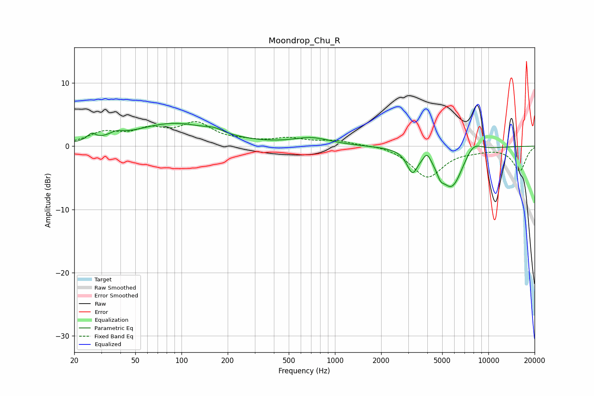

# Moondrop_Chu_R
See [usage instructions](https://github.com/jaakkopasanen/AutoEq#usage) for more options and info.

### Parametric EQs
Apply preamp of -3.7 dB when using parametric equalizer.

|   # | Type    |   Fc (Hz) |    Q |   Gain (dB) |
|-----|---------|-----------|------|-------------|
|   1 | Peaking |        26 | 5.48 |         1   |
|   2 | Peaking |        38 | 3.14 |         0.7 |
|   3 | Peaking |        89 | 0.55 |         3.5 |
|   4 | Peaking |       164 | 2.58 |         0.6 |
|   5 | Peaking |       706 | 1.16 |         1.2 |
|   6 | Peaking |      3198 | 3.99 |        -3.4 |
|   7 | Peaking |      3987 | 6    |         1.4 |
|   8 | Peaking |      4864 | 5.99 |        -1.3 |
|   9 | Peaking |      5769 | 1.82 |        -6.6 |
|  10 | Peaking |      7935 | 2.3  |         2   |

### Fixed Band EQs
When using fixed band (also called graphic) equalizer, apply preamp of **-4.0 dB** (if available) and set gains manually with these parameters.

|   # | Type    |   Fc (Hz) |    Q |   Gain (dB) |
|-----|---------|-----------|------|-------------|
|   1 | Peaking |        31 | 1.41 |         1.9 |
|   2 | Peaking |        62 | 1.41 |         2.2 |
|   3 | Peaking |       125 | 1.41 |         3.3 |
|   4 | Peaking |       250 | 1.41 |         0.5 |
|   5 | Peaking |       500 | 1.41 |         1.1 |
|   6 | Peaking |      1000 | 1.41 |         0.8 |
|   7 | Peaking |      2000 | 1.41 |         0.3 |
|   8 | Peaking |      4000 | 1.41 |        -4.9 |
|   9 | Peaking |      8000 | 1.41 |        -0.4 |
|  10 | Peaking |     16000 | 1.41 |        -3.9 |

### Graphs

