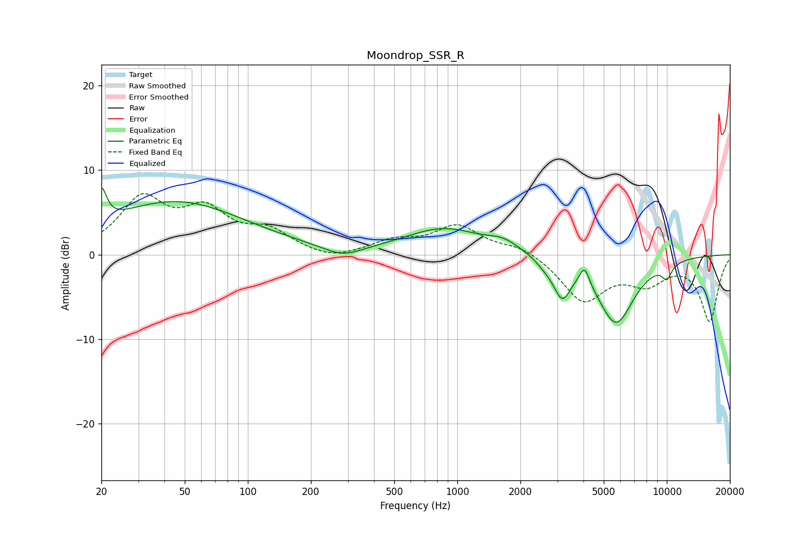

# Moondrop_SSR_R
See [usage instructions](https://github.com/jaakkopasanen/AutoEq#usage) for more options and info.

### Parametric EQs
Apply preamp of -8.0 dB when using parametric equalizer.

|   # | Type    |   Fc (Hz) |    Q |   Gain (dB) |
|-----|---------|-----------|------|-------------|
|   1 | Peaking |        20 | 5.88 |         3.9 |
|   2 | Peaking |        45 | 0.42 |         6.2 |
|   3 | Peaking |       283 | 1.54 |        -1.3 |
|   4 | Peaking |       863 | 0.76 |         3   |
|   5 | Peaking |      1662 | 1.93 |         1.1 |
|   6 | Peaking |      2612 | 3.4  |        -0.6 |
|   7 | Peaking |      3162 | 3.38 |        -4.1 |
|   8 | Peaking |      4045 | 5.91 |         2.3 |
|   9 | Peaking |      5720 | 1.57 |        -8   |
|  10 | Peaking |     10000 | 5.35 |        -1.7 |

### Fixed Band EQs
When using fixed band (also called graphic) equalizer, apply preamp of **-7.3 dB** (if available) and set gains manually with these parameters.

|   # | Type    |   Fc (Hz) |    Q |   Gain (dB) |
|-----|---------|-----------|------|-------------|
|   1 | Peaking |        31 | 1.41 |         6.3 |
|   2 | Peaking |        62 | 1.41 |         4.6 |
|   3 | Peaking |       125 | 1.41 |         2.5 |
|   4 | Peaking |       250 | 1.41 |        -0.8 |
|   5 | Peaking |       500 | 1.41 |         1.5 |
|   6 | Peaking |      1000 | 1.41 |         3.3 |
|   7 | Peaking |      2000 | 1.41 |         1.1 |
|   8 | Peaking |      4000 | 1.41 |        -5.4 |
|   9 | Peaking |      8000 | 1.41 |        -2.9 |
|  10 | Peaking |     16000 | 1.41 |        -7.8 |

### Graphs

