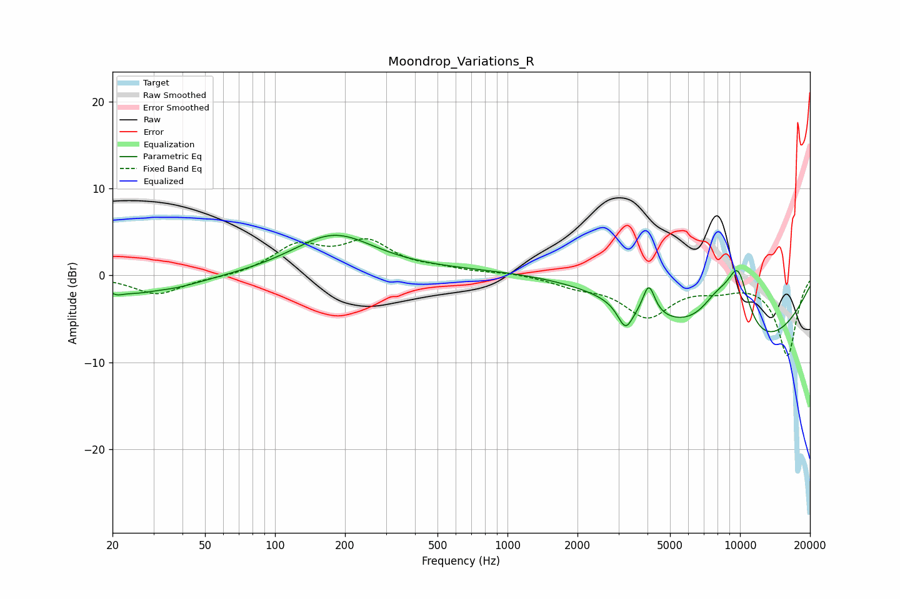

# Moondrop_Variations_R
See [usage instructions](https://github.com/jaakkopasanen/AutoEq#usage) for more options and info.

### Parametric EQs
Apply preamp of -4.7 dB when using parametric equalizer.

|   # | Type    |   Fc (Hz) |    Q |   Gain (dB) |
|-----|---------|-----------|------|-------------|
|   1 | Peaking |        21 | 5.45 |        -0.4 |
|   2 | Peaking |        28 | 0.81 |        -2.5 |
|   3 | Peaking |        31 | 1.89 |         0.5 |
|   4 | Peaking |       179 | 0.8  |         4.6 |
|   5 | Peaking |      1217 | 0.27 |         0.7 |
|   6 | Peaking |      3216 | 4.29 |        -2.9 |
|   7 | Peaking |      4054 | 5.52 |         3.5 |
|   8 | Peaking |      8004 | 1.61 |         4.4 |
|   9 | Peaking |      9765 | 0.33 |        -9.1 |
|  10 | Peaking |      9814 | 2.44 |         7.1 |

### Fixed Band EQs
When using fixed band (also called graphic) equalizer, apply preamp of **-4.3 dB** (if available) and set gains manually with these parameters.

|   # | Type    |   Fc (Hz) |    Q |   Gain (dB) |
|-----|---------|-----------|------|-------------|
|   1 | Peaking |        31 | 1.41 |        -2.2 |
|   2 | Peaking |        62 | 1.41 |        -0.2 |
|   3 | Peaking |       125 | 1.41 |         3.2 |
|   4 | Peaking |       250 | 1.41 |         3.6 |
|   5 | Peaking |       500 | 1.41 |         0.5 |
|   6 | Peaking |      1000 | 1.41 |         0.3 |
|   7 | Peaking |      2000 | 1.41 |        -1   |
|   8 | Peaking |      4000 | 1.41 |        -4.5 |
|   9 | Peaking |      8000 | 1.41 |        -1.1 |
|  10 | Peaking |     16000 | 1.41 |        -9.2 |

### Graphs

