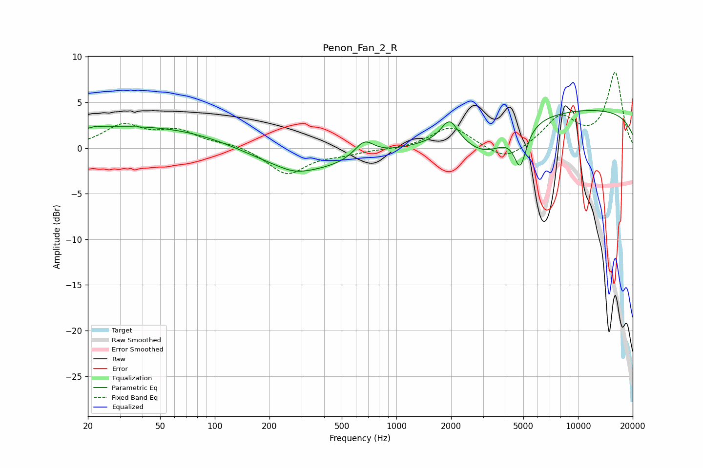

# Penon_Fan_2_R
See [usage instructions](https://github.com/jaakkopasanen/AutoEq#usage) for more options and info.

### Parametric EQs
Apply preamp of -4.2 dB when using parametric equalizer.

|   # | Type    |   Fc (Hz) |    Q |   Gain (dB) |
|-----|---------|-----------|------|-------------|
|   1 | Peaking |        23 | 5.73 |         2.3 |
|   2 | Peaking |        23 | 5.98 |        -2.1 |
|   3 | Peaking |        48 | 0.24 |         2.6 |
|   4 | Peaking |       275 | 1.71 |        -0.5 |
|   5 | Peaking |       277 | 0.45 |        -3.1 |
|   6 | Peaking |       665 | 2.62 |         1.9 |
|   7 | Peaking |      1962 | 3.03 |         2.6 |
|   8 | Peaking |      3138 | 1.1  |        -3.1 |
|   9 | Peaking |      4803 | 4.09 |        -4.2 |
|  10 | Peaking |     10000 | 0.18 |         4.3 |

### Fixed Band EQs
When using fixed band (also called graphic) equalizer, apply preamp of **-8.4 dB** (if available) and set gains manually with these parameters.

|   # | Type    |   Fc (Hz) |    Q |   Gain (dB) |
|-----|---------|-----------|------|-------------|
|   1 | Peaking |        31 | 1.41 |         2.4 |
|   2 | Peaking |        62 | 1.41 |         1.7 |
|   3 | Peaking |       125 | 1.41 |         0.4 |
|   4 | Peaking |       250 | 1.41 |        -2.9 |
|   5 | Peaking |       500 | 1.41 |        -0.5 |
|   6 | Peaking |      1000 | 1.41 |        -0.1 |
|   7 | Peaking |      2000 | 1.41 |         2.4 |
|   8 | Peaking |      4000 | 1.41 |        -1.6 |
|   9 | Peaking |      8000 | 1.41 |         3.3 |
|  10 | Peaking |     16000 | 1.41 |         8.2 |

### Graphs

