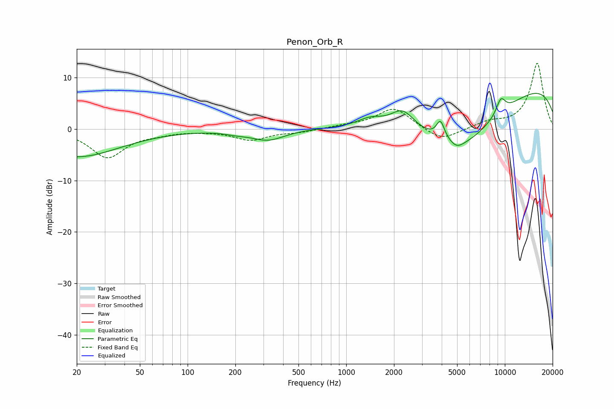

# Penon_Orb_R
See [usage instructions](https://github.com/jaakkopasanen/AutoEq#usage) for more options and info.

### Parametric EQs
Apply preamp of -7.0 dB when using parametric equalizer.

|   # | Type    |   Fc (Hz) |    Q |   Gain (dB) |
|-----|---------|-----------|------|-------------|
|   1 | Peaking |        20 | 0.52 |        -5.4 |
|   2 | Peaking |       204 | 1.99 |        -0.4 |
|   3 | Peaking |       322 | 1.35 |        -2.1 |
|   4 | Peaking |      1416 | 1.83 |         1.5 |
|   5 | Peaking |      2267 | 1.94 |         3.7 |
|   6 | Peaking |      3929 | 5.4  |         3.6 |
|   7 | Peaking |      4992 | 3.47 |        -1   |
|   8 | Peaking |      5275 | 0.48 |       -12.3 |
|   9 | Peaking |      9432 | 4.12 |         3   |
|  10 | Peaking |      9747 | 0.18 |        10.6 |

### Fixed Band EQs
When using fixed band (also called graphic) equalizer, apply preamp of **-12.9 dB** (if available) and set gains manually with these parameters.

|   # | Type    |   Fc (Hz) |    Q |   Gain (dB) |
|-----|---------|-----------|------|-------------|
|   1 | Peaking |        31 | 1.41 |        -5.4 |
|   2 | Peaking |        62 | 1.41 |        -0.6 |
|   3 | Peaking |       125 | 1.41 |        -0.2 |
|   4 | Peaking |       250 | 1.41 |        -2   |
|   5 | Peaking |       500 | 1.41 |        -0.5 |
|   6 | Peaking |      1000 | 1.41 |         0.5 |
|   7 | Peaking |      2000 | 1.41 |         4.1 |
|   8 | Peaking |      4000 | 1.41 |        -2.5 |
|   9 | Peaking |      8000 | 1.41 |         1.2 |
|  10 | Peaking |     16000 | 1.41 |        12.9 |

### Graphs

