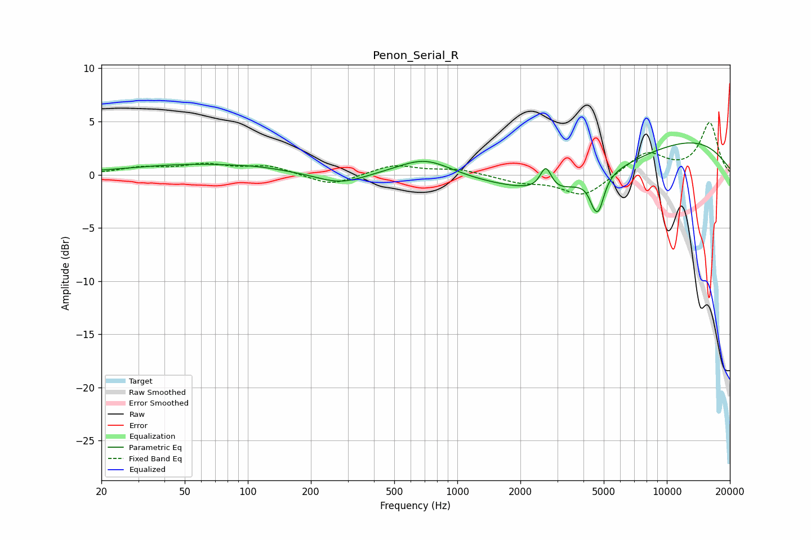

# Penon_Serial_R
See [usage instructions](https://github.com/jaakkopasanen/AutoEq#usage) for more options and info.

### Parametric EQs
Apply preamp of -3.1 dB when using parametric equalizer.

|   # | Type    |   Fc (Hz) |    Q |   Gain (dB) |
|-----|---------|-----------|------|-------------|
|   1 | Peaking |        56 | 0.45 |         0.9 |
|   2 | Peaking |       114 | 1.18 |         0.2 |
|   3 | Peaking |       277 | 1.26 |        -1   |
|   4 | Peaking |       700 | 1.09 |         1.7 |
|   5 | Peaking |      2644 | 5.2  |         2.2 |
|   6 | Peaking |      2855 | 1.54 |        -0.7 |
|   7 | Peaking |      3997 | 0.37 |        -2.8 |
|   8 | Peaking |      4462 | 5.81 |        -1.1 |
|   9 | Peaking |      4732 | 5.19 |        -2.7 |
|  10 | Peaking |     10000 | 0.31 |         4.1 |

### Fixed Band EQs
When using fixed band (also called graphic) equalizer, apply preamp of **-5.0 dB** (if available) and set gains manually with these parameters.

|   # | Type    |   Fc (Hz) |    Q |   Gain (dB) |
|-----|---------|-----------|------|-------------|
|   1 | Peaking |        31 | 1.41 |         0.6 |
|   2 | Peaking |        62 | 1.41 |         0.8 |
|   3 | Peaking |       125 | 1.41 |         0.8 |
|   4 | Peaking |       250 | 1.41 |        -1.1 |
|   5 | Peaking |       500 | 1.41 |         0.9 |
|   6 | Peaking |      1000 | 1.41 |         0.5 |
|   7 | Peaking |      2000 | 1.41 |        -0.6 |
|   8 | Peaking |      4000 | 1.41 |        -2.1 |
|   9 | Peaking |      8000 | 1.41 |         2.1 |
|  10 | Peaking |     16000 | 1.41 |         4.8 |

### Graphs

