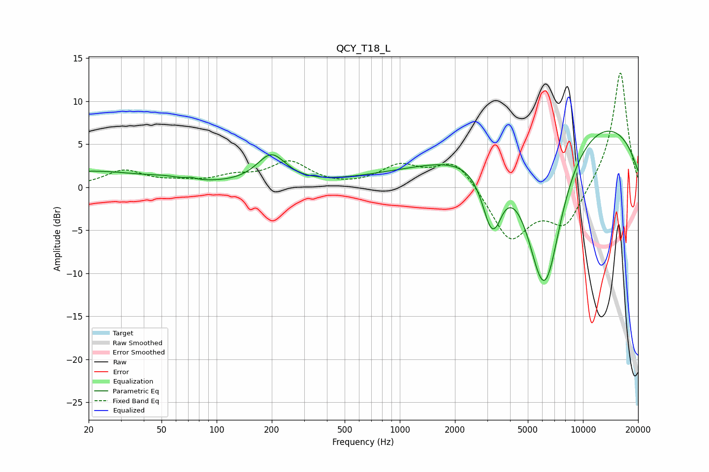

# QCY_T18_L
See [usage instructions](https://github.com/jaakkopasanen/AutoEq#usage) for more options and info.

### Parametric EQs
Apply preamp of -6.6 dB when using parametric equalizer.

|   # | Type    |   Fc (Hz) |    Q |   Gain (dB) |
|-----|---------|-----------|------|-------------|
|   1 | Peaking |        20 | 0.46 |         1.8 |
|   2 | Peaking |        52 | 1.62 |         0.3 |
|   3 | Peaking |        73 | 5.98 |         0.2 |
|   4 | Peaking |       199 | 1.79 |         3.4 |
|   5 | Peaking |      2721 | 0.22 |         1.9 |
|   6 | Peaking |      3171 | 2.6  |        -7.4 |
|   7 | Peaking |      3449 | 6    |        -0.5 |
|   8 | Peaking |      5871 | 1.69 |        -6.5 |
|   9 | Peaking |      6355 | 1.27 |       -13.4 |
|  10 | Peaking |      9821 | 0.24 |         8.4 |

### Fixed Band EQs
When using fixed band (also called graphic) equalizer, apply preamp of **-13.4 dB** (if available) and set gains manually with these parameters.

|   # | Type    |   Fc (Hz) |    Q |   Gain (dB) |
|-----|---------|-----------|------|-------------|
|   1 | Peaking |        31 | 1.41 |         1.9 |
|   2 | Peaking |        62 | 1.41 |         0.4 |
|   3 | Peaking |       125 | 1.41 |         1   |
|   4 | Peaking |       250 | 1.41 |         2.8 |
|   5 | Peaking |       500 | 1.41 |        -0.1 |
|   6 | Peaking |      1000 | 1.41 |         2.3 |
|   7 | Peaking |      2000 | 1.41 |         3.3 |
|   8 | Peaking |      4000 | 1.41 |        -6.1 |
|   9 | Peaking |      8000 | 1.41 |        -4.5 |
|  10 | Peaking |     16000 | 1.41 |        13.7 |

### Graphs

