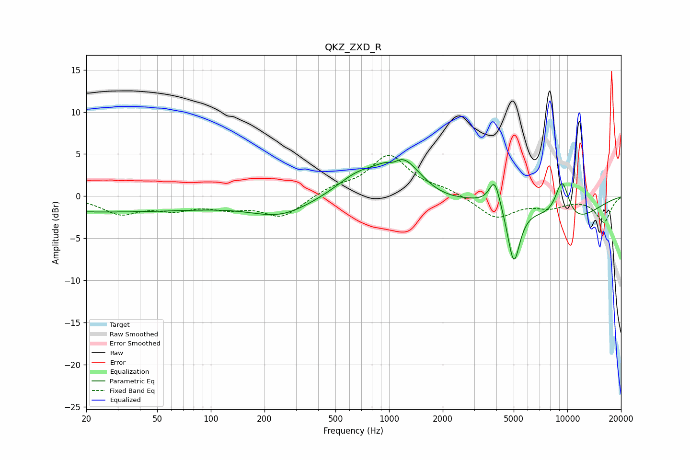

# QKZ_ZXD_R
See [usage instructions](https://github.com/jaakkopasanen/AutoEq#usage) for more options and info.

### Parametric EQs
Apply preamp of -4.4 dB when using parametric equalizer.

|   # | Type    |   Fc (Hz) |    Q |   Gain (dB) |
|-----|---------|-----------|------|-------------|
|   1 | Peaking |        23 | 0.18 |        -1.8 |
|   2 | Peaking |       247 | 0.82 |        -2.1 |
|   3 | Peaking |       664 | 1.16 |         2.1 |
|   4 | Peaking |      1062 | 4.22 |        -0.8 |
|   5 | Peaking |      1158 | 1.28 |         4.7 |
|   6 | Peaking |      1941 | 0.99 |        -0.9 |
|   7 | Peaking |      3911 | 4.59 |         3.3 |
|   8 | Peaking |      5008 | 3.96 |        -6.9 |
|   9 | Peaking |      9352 | 3.07 |         4.9 |
|  10 | Peaking |     10000 | 0.68 |        -3.3 |

### Fixed Band EQs
When using fixed band (also called graphic) equalizer, apply preamp of **-4.9 dB** (if available) and set gains manually with these parameters.

|   # | Type    |   Fc (Hz) |    Q |   Gain (dB) |
|-----|---------|-----------|------|-------------|
|   1 | Peaking |        31 | 1.41 |        -1.9 |
|   2 | Peaking |        62 | 1.41 |        -1.3 |
|   3 | Peaking |       125 | 1.41 |        -1.1 |
|   4 | Peaking |       250 | 1.41 |        -2.4 |
|   5 | Peaking |       500 | 1.41 |         0.9 |
|   6 | Peaking |      1000 | 1.41 |         4.7 |
|   7 | Peaking |      2000 | 1.41 |         0.7 |
|   8 | Peaking |      4000 | 1.41 |        -2.6 |
|   9 | Peaking |      8000 | 1.41 |        -1.1 |
|  10 | Peaking |     16000 | 1.41 |        -3   |

### Graphs

