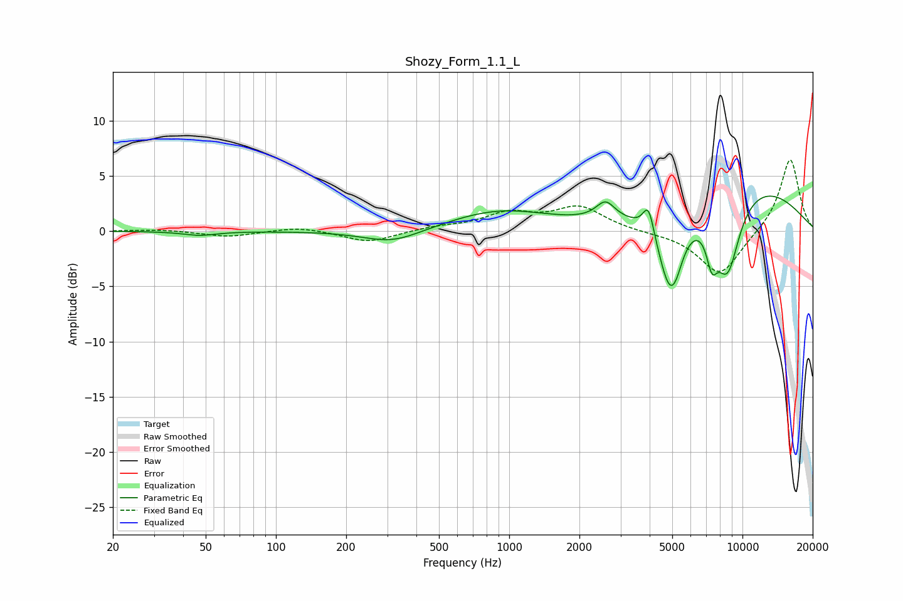

# Shozy_Form_1.1_L
See [usage instructions](https://github.com/jaakkopasanen/AutoEq#usage) for more options and info.

### Parametric EQs
Apply preamp of -3.3 dB when using parametric equalizer.

|   # | Type    |   Fc (Hz) |    Q |   Gain (dB) |
|-----|---------|-----------|------|-------------|
|   1 | Peaking |        47 | 1.99 |        -0.4 |
|   2 | Peaking |       317 | 1.12 |        -1.2 |
|   3 | Peaking |       909 | 0.65 |         1.8 |
|   4 | Peaking |      2588 | 3.5  |         1.6 |
|   5 | Peaking |      3956 | 5.98 |         2.6 |
|   6 | Peaking |      4893 | 2.66 |        -7.1 |
|   7 | Peaking |      5204 | 6    |        -0.5 |
|   8 | Peaking |      7393 | 5.47 |        -3.1 |
|   9 | Peaking |      8616 | 2.3  |        -7.2 |
|  10 | Peaking |     10000 | 0.4  |         4.5 |

### Fixed Band EQs
When using fixed band (also called graphic) equalizer, apply preamp of **-6.5 dB** (if available) and set gains manually with these parameters.

|   # | Type    |   Fc (Hz) |    Q |   Gain (dB) |
|-----|---------|-----------|------|-------------|
|   1 | Peaking |        31 | 1.41 |         0.2 |
|   2 | Peaking |        62 | 1.41 |        -0.5 |
|   3 | Peaking |       125 | 1.41 |         0.4 |
|   4 | Peaking |       250 | 1.41 |        -1   |
|   5 | Peaking |       500 | 1.41 |         0.3 |
|   6 | Peaking |      1000 | 1.41 |         1.5 |
|   7 | Peaking |      2000 | 1.41 |         2.1 |
|   8 | Peaking |      4000 | 1.41 |        -0.1 |
|   9 | Peaking |      8000 | 1.41 |        -4.1 |
|  10 | Peaking |     16000 | 1.41 |         6.7 |

### Graphs

