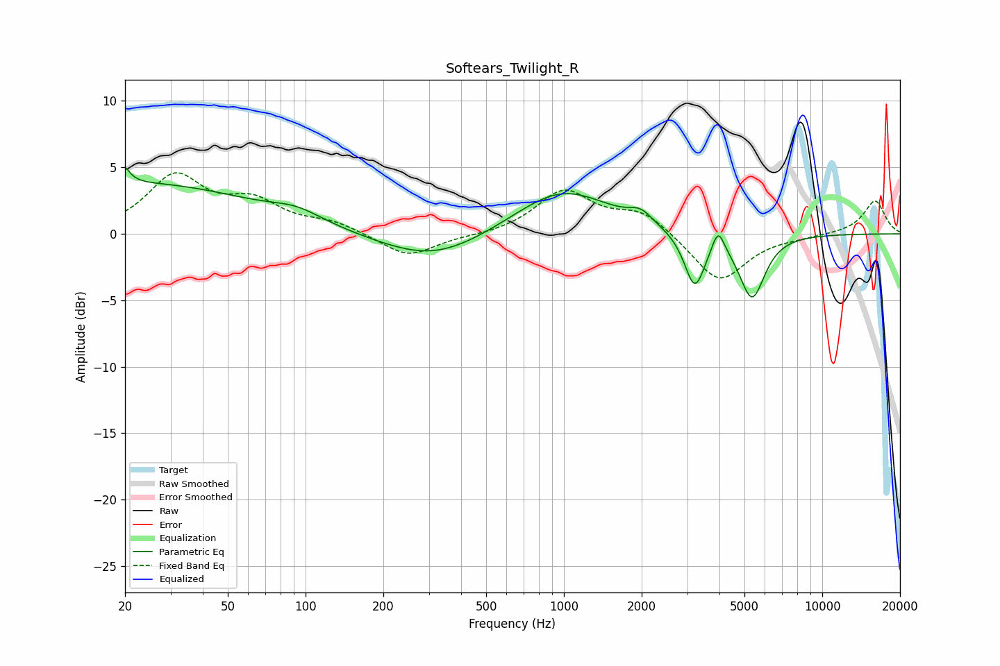

# Softears_Twilight_R
See [usage instructions](https://github.com/jaakkopasanen/AutoEq#usage) for more options and info.

### Parametric EQs
Apply preamp of -5.1 dB when using parametric equalizer.

|   # | Type    |   Fc (Hz) |    Q |   Gain (dB) |
|-----|---------|-----------|------|-------------|
|   1 | Peaking |        20 | 5.88 |         3.2 |
|   2 | Peaking |        20 | 6    |        -2   |
|   3 | Peaking |        23 | 0.32 |         3.7 |
|   4 | Peaking |        93 | 1.45 |         0.8 |
|   5 | Peaking |       311 | 0.7  |        -2.1 |
|   6 | Peaking |       985 | 0.76 |         3.4 |
|   7 | Peaking |      1983 | 3.18 |         0.9 |
|   8 | Peaking |      3210 | 3.56 |        -4.1 |
|   9 | Peaking |      3955 | 6    |         1.8 |
|  10 | Peaking |      5350 | 2.83 |        -4.8 |

### Fixed Band EQs
When using fixed band (also called graphic) equalizer, apply preamp of **-4.7 dB** (if available) and set gains manually with these parameters.

|   # | Type    |   Fc (Hz) |    Q |   Gain (dB) |
|-----|---------|-----------|------|-------------|
|   1 | Peaking |        31 | 1.41 |         4.2 |
|   2 | Peaking |        62 | 1.41 |         2.1 |
|   3 | Peaking |       125 | 1.41 |         0.8 |
|   4 | Peaking |       250 | 1.41 |        -1.8 |
|   5 | Peaking |       500 | 1.41 |        -0.1 |
|   6 | Peaking |      1000 | 1.41 |         3.2 |
|   7 | Peaking |      2000 | 1.41 |         1.6 |
|   8 | Peaking |      4000 | 1.41 |        -3.7 |
|   9 | Peaking |      8000 | 1.41 |        -0.2 |
|  10 | Peaking |     16000 | 1.41 |         2.5 |

### Graphs

