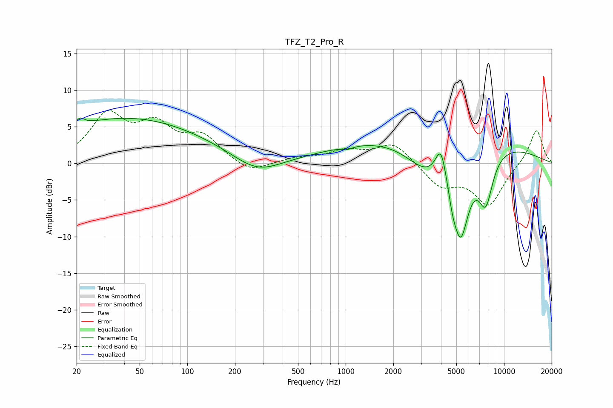

# TFZ_T2_Pro_R
See [usage instructions](https://github.com/jaakkopasanen/AutoEq#usage) for more options and info.

### Parametric EQs
Apply preamp of -6.3 dB when using parametric equalizer.

|   # | Type    |   Fc (Hz) |    Q |   Gain (dB) |
|-----|---------|-----------|------|-------------|
|   1 | Peaking |        21 | 5.52 |         1   |
|   2 | Peaking |        42 | 0.28 |         6.2 |
|   3 | Peaking |       276 | 0.95 |        -2.4 |
|   4 | Peaking |      1028 | 4.51 |        -0.4 |
|   5 | Peaking |      3185 | 1.07 |        -3.7 |
|   6 | Peaking |      3759 | 0.21 |         4.3 |
|   7 | Peaking |      3998 | 4.11 |         4.5 |
|   8 | Peaking |      4724 | 5.9  |        -1.6 |
|   9 | Peaking |      5309 | 2.34 |       -12   |
|  10 | Peaking |      7666 | 2.87 |        -6.6 |

### Fixed Band EQs
When using fixed band (also called graphic) equalizer, apply preamp of **-7.3 dB** (if available) and set gains manually with these parameters.

|   # | Type    |   Fc (Hz) |    Q |   Gain (dB) |
|-----|---------|-----------|------|-------------|
|   1 | Peaking |        31 | 1.41 |         6.2 |
|   2 | Peaking |        62 | 1.41 |         4.5 |
|   3 | Peaking |       125 | 1.41 |         3.3 |
|   4 | Peaking |       250 | 1.41 |        -1.5 |
|   5 | Peaking |       500 | 1.41 |         0.7 |
|   6 | Peaking |      1000 | 1.41 |         1.6 |
|   7 | Peaking |      2000 | 1.41 |         2.8 |
|   8 | Peaking |      4000 | 1.41 |        -3   |
|   9 | Peaking |      8000 | 1.41 |        -5.6 |
|  10 | Peaking |     16000 | 1.41 |         4.8 |

### Graphs

