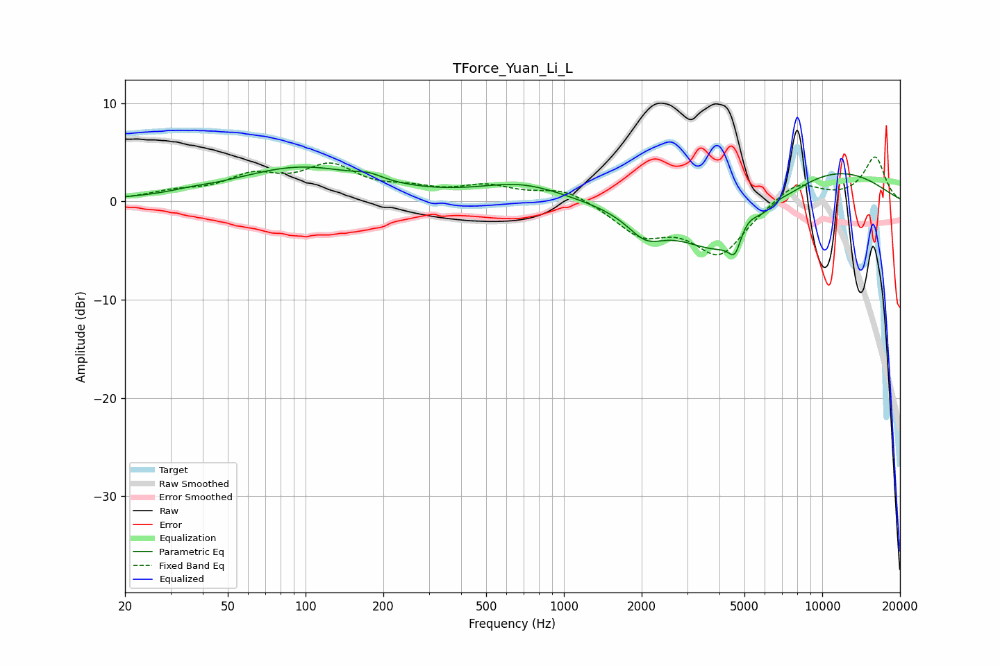

# TForce_Yuan_Li_L
See [usage instructions](https://github.com/jaakkopasanen/AutoEq#usage) for more options and info.

### Parametric EQs
Apply preamp of -3.6 dB when using parametric equalizer.

|   # | Type    |   Fc (Hz) |    Q |   Gain (dB) |
|-----|---------|-----------|------|-------------|
|   1 | Peaking |        36 | 2.07 |         0.2 |
|   2 | Peaking |        96 | 0.55 |         3.4 |
|   3 | Peaking |       176 | 2.84 |         0.5 |
|   4 | Peaking |       690 | 0.84 |         1.8 |
|   5 | Peaking |      2070 | 2.03 |        -2.3 |
|   6 | Peaking |      4298 | 0.77 |        -6.9 |
|   7 | Peaking |      4599 | 5.95 |        -2.1 |
|   8 | Peaking |      5103 | 2.94 |         1.9 |
|   9 | Peaking |      6823 | 4.19 |         0.4 |
|  10 | Peaking |      9588 | 0.43 |         4.1 |

### Fixed Band EQs
When using fixed band (also called graphic) equalizer, apply preamp of **-4.6 dB** (if available) and set gains manually with these parameters.

|   # | Type    |   Fc (Hz) |    Q |   Gain (dB) |
|-----|---------|-----------|------|-------------|
|   1 | Peaking |        31 | 1.41 |         0.8 |
|   2 | Peaking |        62 | 1.41 |         2.3 |
|   3 | Peaking |       125 | 1.41 |         3.3 |
|   4 | Peaking |       250 | 1.41 |         0.9 |
|   5 | Peaking |       500 | 1.41 |         1.4 |
|   6 | Peaking |      1000 | 1.41 |         1.4 |
|   7 | Peaking |      2000 | 1.41 |        -3.1 |
|   8 | Peaking |      4000 | 1.41 |        -5.3 |
|   9 | Peaking |      8000 | 1.41 |         2.2 |
|  10 | Peaking |     16000 | 1.41 |         4.5 |

### Graphs

