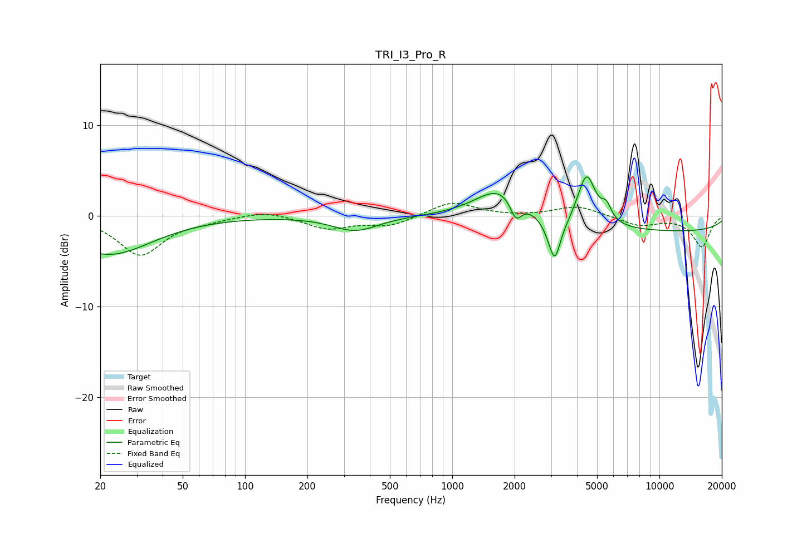

# TRI_I3_Pro_R
See [usage instructions](https://github.com/jaakkopasanen/AutoEq#usage) for more options and info.

### Parametric EQs
Apply preamp of -4.4 dB when using parametric equalizer.

|   # | Type    |   Fc (Hz) |    Q |   Gain (dB) |
|-----|---------|-----------|------|-------------|
|   1 | Peaking |        22 | 0.68 |        -4.3 |
|   2 | Peaking |       297 | 2.07 |        -0.1 |
|   3 | Peaking |       343 | 1.28 |        -1.6 |
|   4 | Peaking |      1723 | 1.17 |         3.6 |
|   5 | Peaking |      2029 | 4.96 |        -2.3 |
|   6 | Peaking |      3146 | 4.31 |        -5.9 |
|   7 | Peaking |      3280 | 5.7  |         1   |
|   8 | Peaking |      4451 | 3.25 |         5.7 |
|   9 | Peaking |      5546 | 5.8  |         1.6 |
|  10 | Peaking |     10000 | 0.18 |        -1.8 |

### Fixed Band EQs
When using fixed band (also called graphic) equalizer, apply preamp of **-1.5 dB** (if available) and set gains manually with these parameters.

|   # | Type    |   Fc (Hz) |    Q |   Gain (dB) |
|-----|---------|-----------|------|-------------|
|   1 | Peaking |        31 | 1.41 |        -4.3 |
|   2 | Peaking |        62 | 1.41 |        -0.4 |
|   3 | Peaking |       125 | 1.41 |         0.6 |
|   4 | Peaking |       250 | 1.41 |        -1.4 |
|   5 | Peaking |       500 | 1.41 |        -1.1 |
|   6 | Peaking |      1000 | 1.41 |         1.6 |
|   7 | Peaking |      2000 | 1.41 |        -0.1 |
|   8 | Peaking |      4000 | 1.41 |         1.1 |
|   9 | Peaking |      8000 | 1.41 |        -1.1 |
|  10 | Peaking |     16000 | 1.41 |        -3.4 |

### Graphs

