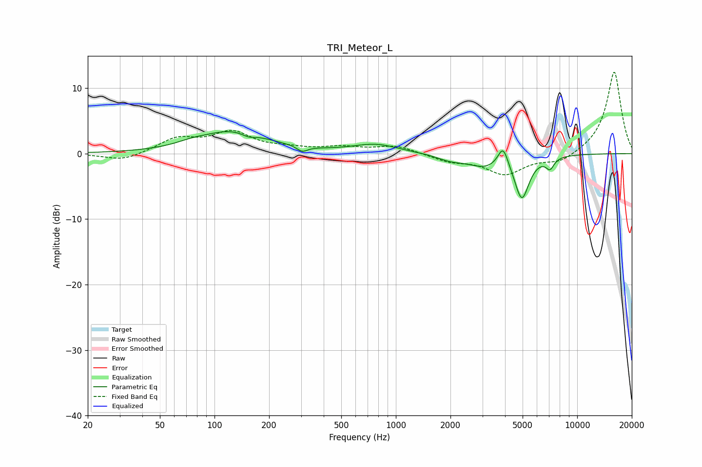

# TRI_Meteor_L
See [usage instructions](https://github.com/jaakkopasanen/AutoEq#usage) for more options and info.

### Parametric EQs
Apply preamp of -3.4 dB when using parametric equalizer.

|   # | Type    |   Fc (Hz) |    Q |   Gain (dB) |
|-----|---------|-----------|------|-------------|
|   1 | Peaking |        74 | 2    |         0.4 |
|   2 | Peaking |       126 | 0.74 |         3.4 |
|   3 | Peaking |       154 | 3.69 |        -0.6 |
|   4 | Peaking |       305 | 4.85 |        -0.9 |
|   5 | Peaking |       774 | 1.12 |         1.4 |
|   6 | Peaking |      1998 | 1.9  |        -0.8 |
|   7 | Peaking |      3076 | 1.53 |        -1.7 |
|   8 | Peaking |      3901 | 5    |         3.2 |
|   9 | Peaking |      4950 | 3.51 |        -6.6 |
|  10 | Peaking |      7080 | 6    |        -1.6 |

### Fixed Band EQs
When using fixed band (also called graphic) equalizer, apply preamp of **-12.5 dB** (if available) and set gains manually with these parameters.

|   # | Type    |   Fc (Hz) |    Q |   Gain (dB) |
|-----|---------|-----------|------|-------------|
|   1 | Peaking |        31 | 1.41 |        -1.2 |
|   2 | Peaking |        62 | 1.41 |         2.2 |
|   3 | Peaking |       125 | 1.41 |         3   |
|   4 | Peaking |       250 | 1.41 |         0.6 |
|   5 | Peaking |       500 | 1.41 |         0.8 |
|   6 | Peaking |      1000 | 1.41 |         1.2 |
|   7 | Peaking |      2000 | 1.41 |        -1.1 |
|   8 | Peaking |      4000 | 1.41 |        -3.1 |
|   9 | Peaking |      8000 | 1.41 |        -1.4 |
|  10 | Peaking |     16000 | 1.41 |        12.6 |

### Graphs

