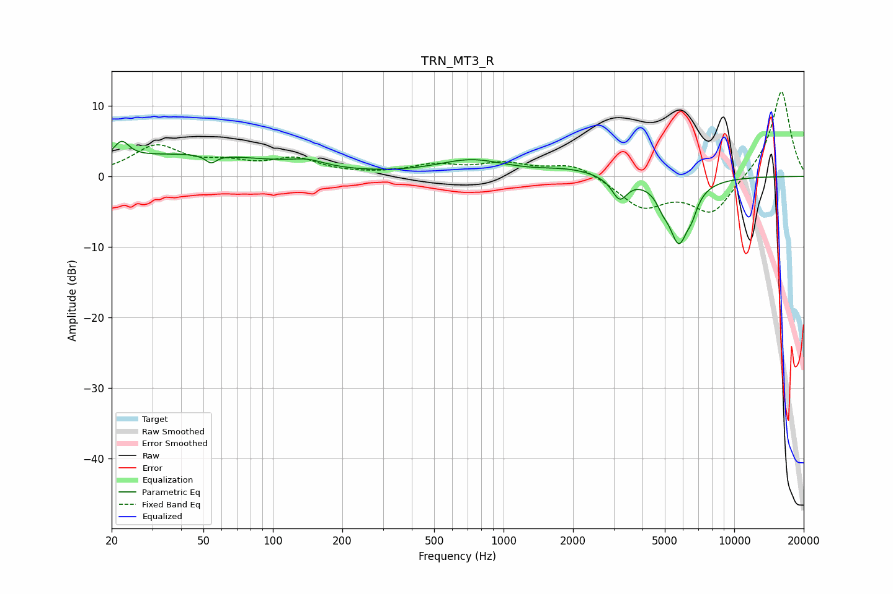

# TRN_MT3_R
See [usage instructions](https://github.com/jaakkopasanen/AutoEq#usage) for more options and info.

### Parametric EQs
Apply preamp of -5.1 dB when using parametric equalizer.

|   # | Type    |   Fc (Hz) |    Q |   Gain (dB) |
|-----|---------|-----------|------|-------------|
|   1 | Peaking |        22 | 4.37 |         2.4 |
|   2 | Peaking |        41 | 0.35 |         3.1 |
|   3 | Peaking |        54 | 6    |        -1.2 |
|   4 | Peaking |       141 | 1.85 |         0.9 |
|   5 | Peaking |       727 | 0.94 |         2.2 |
|   6 | Peaking |      1938 | 1.14 |         0.9 |
|   7 | Peaking |      3184 | 4.25 |        -3.1 |
|   8 | Peaking |      4892 | 5.52 |        -1.3 |
|   9 | Peaking |      5751 | 3.02 |        -8.9 |
|  10 | Peaking |      6565 | 6    |        -1.6 |

### Fixed Band EQs
When using fixed band (also called graphic) equalizer, apply preamp of **-12.1 dB** (if available) and set gains manually with these parameters.

|   # | Type    |   Fc (Hz) |    Q |   Gain (dB) |
|-----|---------|-----------|------|-------------|
|   1 | Peaking |        31 | 1.41 |         4.1 |
|   2 | Peaking |        62 | 1.41 |         1.5 |
|   3 | Peaking |       125 | 1.41 |         2.2 |
|   4 | Peaking |       250 | 1.41 |         0.1 |
|   5 | Peaking |       500 | 1.41 |         1.4 |
|   6 | Peaking |      1000 | 1.41 |         1.6 |
|   7 | Peaking |      2000 | 1.41 |         1.9 |
|   8 | Peaking |      4000 | 1.41 |        -4.2 |
|   9 | Peaking |      8000 | 1.41 |        -5.2 |
|  10 | Peaking |     16000 | 1.41 |        12.4 |

### Graphs

