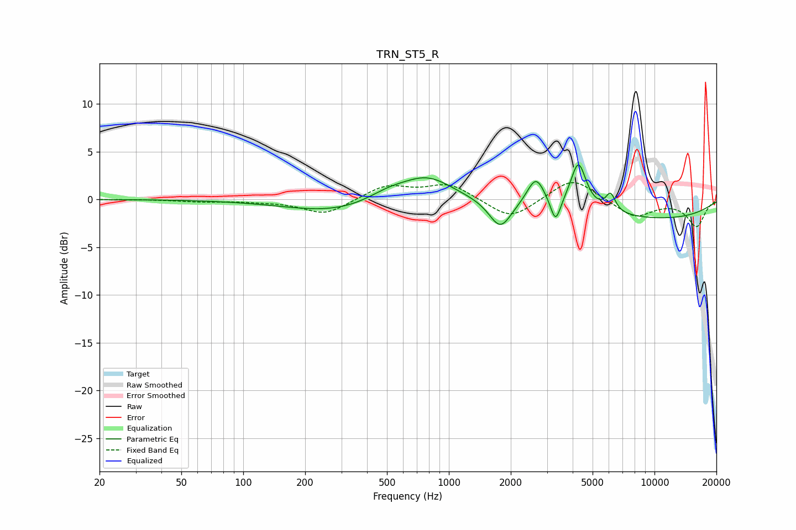

# TRN_ST5_R
See [usage instructions](https://github.com/jaakkopasanen/AutoEq#usage) for more options and info.

### Parametric EQs
Apply preamp of -3.7 dB when using parametric equalizer.

|   # | Type    |   Fc (Hz) |    Q |   Gain (dB) |
|-----|---------|-----------|------|-------------|
|   1 | Peaking |       286 | 0.58 |        -1.4 |
|   2 | Peaking |       507 | 1.29 |         1.1 |
|   3 | Peaking |       668 | 1.04 |         0   |
|   4 | Peaking |       787 | 1.15 |         2.4 |
|   5 | Peaking |      1779 | 2.6  |        -3   |
|   6 | Peaking |      2651 | 3.3  |         3   |
|   7 | Peaking |      3303 | 5.84 |        -2.6 |
|   8 | Peaking |      4266 | 3.75 |         4.9 |
|   9 | Peaking |      6115 | 5.77 |         1.8 |
|  10 | Peaking |     10000 | 0.32 |        -2   |

### Fixed Band EQs
When using fixed band (also called graphic) equalizer, apply preamp of **-1.9 dB** (if available) and set gains manually with these parameters.

|   # | Type    |   Fc (Hz) |    Q |   Gain (dB) |
|-----|---------|-----------|------|-------------|
|   1 | Peaking |        31 | 1.41 |         0   |
|   2 | Peaking |        62 | 1.41 |        -0.2 |
|   3 | Peaking |       125 | 1.41 |        -0.2 |
|   4 | Peaking |       250 | 1.41 |        -1.6 |
|   5 | Peaking |       500 | 1.41 |         1.5 |
|   6 | Peaking |      1000 | 1.41 |         1.6 |
|   7 | Peaking |      2000 | 1.41 |        -2.2 |
|   8 | Peaking |      4000 | 1.41 |         2.4 |
|   9 | Peaking |      8000 | 1.41 |        -1.9 |
|  10 | Peaking |     16000 | 1.41 |        -2.8 |

### Graphs

