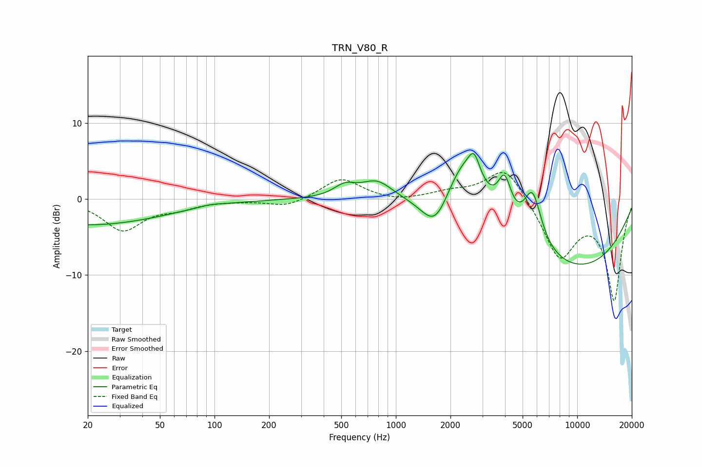

# TRN_V80_R
See [usage instructions](https://github.com/jaakkopasanen/AutoEq#usage) for more options and info.

### Parametric EQs
Apply preamp of -6.1 dB when using parametric equalizer.

|   # | Type    |   Fc (Hz) |    Q |   Gain (dB) |
|-----|---------|-----------|------|-------------|
|   1 | Peaking |        20 | 0.33 |        -3.4 |
|   2 | Peaking |        95 | 2.06 |         0.3 |
|   3 | Peaking |       523 | 2.3  |         1.5 |
|   4 | Peaking |       787 | 1.64 |         2.4 |
|   5 | Peaking |      1653 | 1.79 |        -5   |
|   6 | Peaking |      2378 | 1.23 |         8.2 |
|   7 | Peaking |      2702 | 4.55 |         2.9 |
|   8 | Peaking |      3977 | 3.77 |         5.1 |
|   9 | Peaking |      5676 | 2.74 |         7.1 |
|  10 | Peaking |      9221 | 0.31 |        -9.3 |

### Fixed Band EQs
When using fixed band (also called graphic) equalizer, apply preamp of **-3.6 dB** (if available) and set gains manually with these parameters.

|   # | Type    |   Fc (Hz) |    Q |   Gain (dB) |
|-----|---------|-----------|------|-------------|
|   1 | Peaking |        31 | 1.41 |        -4   |
|   2 | Peaking |        62 | 1.41 |        -1   |
|   3 | Peaking |       125 | 1.41 |        -0.1 |
|   4 | Peaking |       250 | 1.41 |        -1.1 |
|   5 | Peaking |       500 | 1.41 |         2.8 |
|   6 | Peaking |      1000 | 1.41 |        -0.4 |
|   7 | Peaking |      2000 | 1.41 |         0.8 |
|   8 | Peaking |      4000 | 1.41 |         4.6 |
|   9 | Peaking |      8000 | 1.41 |        -7.6 |
|  10 | Peaking |     16000 | 1.41 |       -13.1 |

### Graphs

