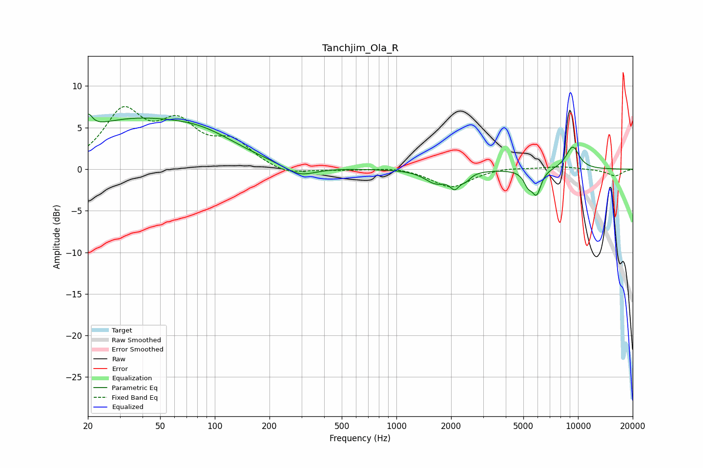

# Tanchjim_Ola_R
See [usage instructions](https://github.com/jaakkopasanen/AutoEq#usage) for more options and info.

### Parametric EQs
Apply preamp of -6.7 dB when using parametric equalizer.

|   # | Type    |   Fc (Hz) |    Q |   Gain (dB) |
|-----|---------|-----------|------|-------------|
|   1 | Peaking |        20 | 6    |         1.8 |
|   2 | Peaking |        32 | 0.41 |         5.4 |
|   3 | Peaking |        87 | 0.7  |         2.3 |
|   4 | Peaking |       293 | 1.63 |        -1.3 |
|   5 | Peaking |      1644 | 2.35 |        -1.5 |
|   6 | Peaking |      2095 | 5.22 |        -1.6 |
|   7 | Peaking |      2415 | 5.23 |        -0.7 |
|   8 | Peaking |      5301 | 5.88 |        -1.5 |
|   9 | Peaking |      5912 | 5.51 |        -2.8 |
|  10 | Peaking |      9341 | 3.35 |         2.7 |

### Fixed Band EQs
When using fixed band (also called graphic) equalizer, apply preamp of **-7.6 dB** (if available) and set gains manually with these parameters.

|   # | Type    |   Fc (Hz) |    Q |   Gain (dB) |
|-----|---------|-----------|------|-------------|
|   1 | Peaking |        31 | 1.41 |         6.5 |
|   2 | Peaking |        62 | 1.41 |         4.7 |
|   3 | Peaking |       125 | 1.41 |         2.9 |
|   4 | Peaking |       250 | 1.41 |        -0.9 |
|   5 | Peaking |       500 | 1.41 |        -0.1 |
|   6 | Peaking |      1000 | 1.41 |         0.3 |
|   7 | Peaking |      2000 | 1.41 |        -2.2 |
|   8 | Peaking |      4000 | 1.41 |         0.3 |
|   9 | Peaking |      8000 | 1.41 |         0.3 |
|  10 | Peaking |     16000 | 1.41 |        -0.8 |

### Graphs

