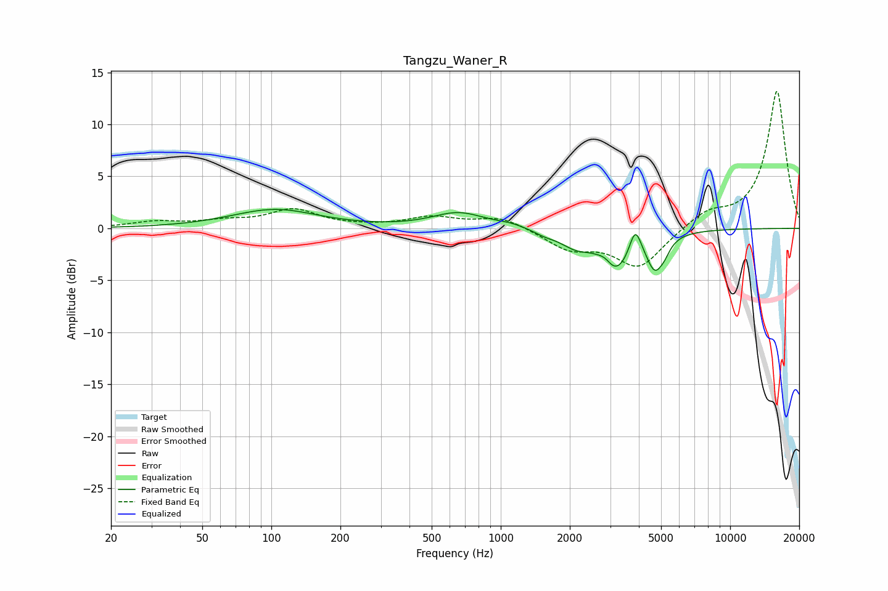

# Tangzu_Waner_R
See [usage instructions](https://github.com/jaakkopasanen/AutoEq#usage) for more options and info.

### Parametric EQs
Apply preamp of -1.9 dB when using parametric equalizer.

|   # | Type    |   Fc (Hz) |    Q |   Gain (dB) |
|-----|---------|-----------|------|-------------|
|   1 | Peaking |       103 | 0.76 |         1.8 |
|   2 | Peaking |       656 | 1.24 |         1.5 |
|   3 | Peaking |      1105 | 2.18 |         0.3 |
|   4 | Peaking |      1555 | 2.96 |        -0.4 |
|   5 | Peaking |      2119 | 2.05 |        -1.4 |
|   6 | Peaking |      2849 | 4.84 |         0.6 |
|   7 | Peaking |      3181 | 2.13 |        -3.7 |
|   8 | Peaking |      3859 | 5.57 |         2.6 |
|   9 | Peaking |      4702 | 3.73 |        -3.3 |
|  10 | Peaking |      5193 | 6    |        -0.7 |

### Fixed Band EQs
When using fixed band (also called graphic) equalizer, apply preamp of **-13.3 dB** (if available) and set gains manually with these parameters.

|   # | Type    |   Fc (Hz) |    Q |   Gain (dB) |
|-----|---------|-----------|------|-------------|
|   1 | Peaking |        31 | 1.41 |         0.6 |
|   2 | Peaking |        62 | 1.41 |         0.6 |
|   3 | Peaking |       125 | 1.41 |         1.7 |
|   4 | Peaking |       250 | 1.41 |         0.1 |
|   5 | Peaking |       500 | 1.41 |         1   |
|   6 | Peaking |      1000 | 1.41 |         1.1 |
|   7 | Peaking |      2000 | 1.41 |        -1.9 |
|   8 | Peaking |      4000 | 1.41 |        -3.7 |
|   9 | Peaking |      8000 | 1.41 |         1.4 |
|  10 | Peaking |     16000 | 1.41 |        13.2 |

### Graphs

