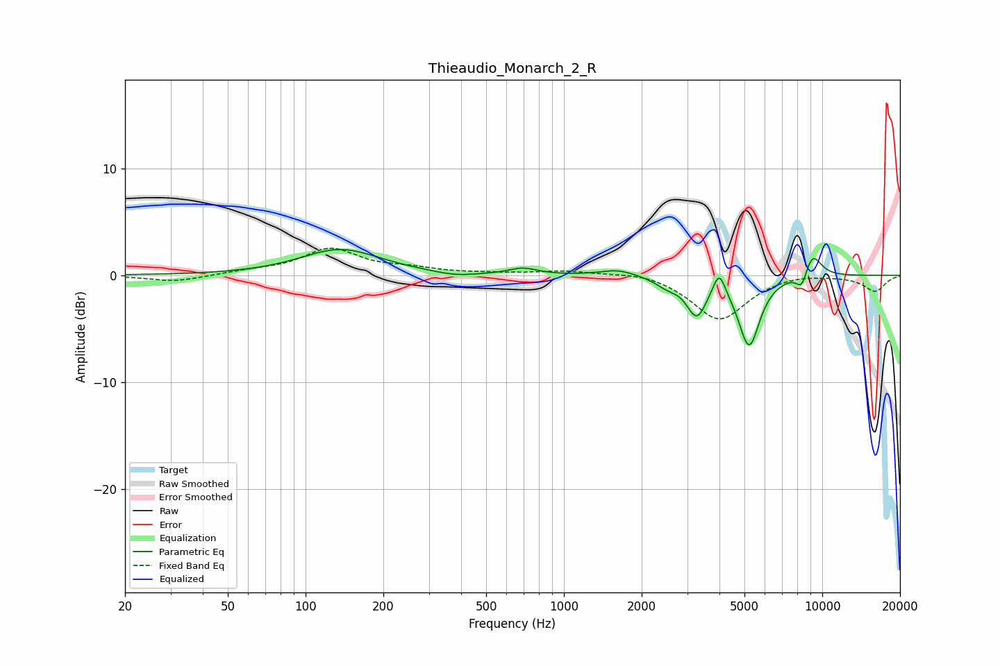

# Thieaudio_Monarch_2_R
See [usage instructions](https://github.com/jaakkopasanen/AutoEq#usage) for more options and info.

### Parametric EQs
Apply preamp of -2.5 dB when using parametric equalizer.

|   # | Type    |   Fc (Hz) |    Q |   Gain (dB) |
|-----|---------|-----------|------|-------------|
|   1 | Peaking |       137 | 0.93 |         2.4 |
|   2 | Peaking |       380 | 1.81 |        -0.4 |
|   3 | Peaking |       692 | 2.64 |         0.6 |
|   4 | Peaking |      1621 | 2.11 |         0.6 |
|   5 | Peaking |      2509 | 3.19 |        -0.7 |
|   6 | Peaking |      3267 | 3.61 |        -3.5 |
|   7 | Peaking |      3990 | 5.99 |         2.2 |
|   8 | Peaking |      5212 | 3.35 |        -6.5 |
|   9 | Peaking |      8342 | 5.94 |        -1.6 |
|  10 | Peaking |      9147 | 3.56 |         2.3 |

### Fixed Band EQs
When using fixed band (also called graphic) equalizer, apply preamp of **-2.6 dB** (if available) and set gains manually with these parameters.

|   # | Type    |   Fc (Hz) |    Q |   Gain (dB) |
|-----|---------|-----------|------|-------------|
|   1 | Peaking |        31 | 1.41 |        -0.6 |
|   2 | Peaking |        62 | 1.41 |         0.3 |
|   3 | Peaking |       125 | 1.41 |         2.4 |
|   4 | Peaking |       250 | 1.41 |         0.5 |
|   5 | Peaking |       500 | 1.41 |         0.1 |
|   6 | Peaking |      1000 | 1.41 |         0.4 |
|   7 | Peaking |      2000 | 1.41 |         0.4 |
|   8 | Peaking |      4000 | 1.41 |        -4.2 |
|   9 | Peaking |      8000 | 1.41 |         0.3 |
|  10 | Peaking |     16000 | 1.41 |        -1.5 |

### Graphs

