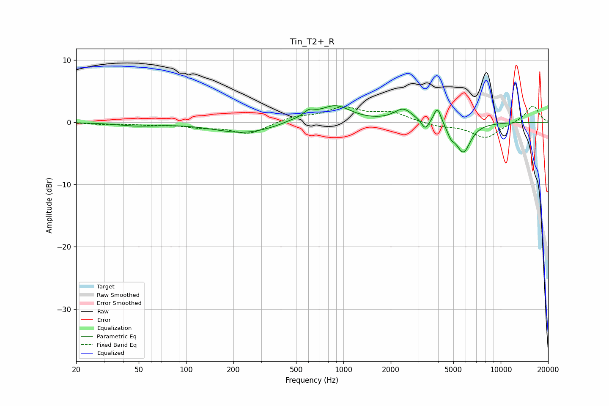

# Tin_T2+_R
See [usage instructions](https://github.com/jaakkopasanen/AutoEq#usage) for more options and info.

### Parametric EQs
Apply preamp of -2.7 dB when using parametric equalizer.

|   # | Type    |   Fc (Hz) |    Q |   Gain (dB) |
|-----|---------|-----------|------|-------------|
|   1 | Peaking |        49 | 1.11 |        -0.5 |
|   2 | Peaking |       233 | 0.76 |        -1.7 |
|   3 | Peaking |       459 | 2.43 |         0.3 |
|   4 | Peaking |       603 | 3.75 |         1.2 |
|   5 | Peaking |       885 | 1.42 |         2.7 |
|   6 | Peaking |      2404 | 2.39 |         2   |
|   7 | Peaking |      3311 | 6    |        -1.6 |
|   8 | Peaking |      3961 | 5.96 |         2.7 |
|   9 | Peaking |      4833 | 5.99 |        -1.3 |
|  10 | Peaking |      5779 | 2.96 |        -4.8 |

### Fixed Band EQs
When using fixed band (also called graphic) equalizer, apply preamp of **-2.7 dB** (if available) and set gains manually with these parameters.

|   # | Type    |   Fc (Hz) |    Q |   Gain (dB) |
|-----|---------|-----------|------|-------------|
|   1 | Peaking |        31 | 1.41 |        -0.3 |
|   2 | Peaking |        62 | 1.41 |        -0.3 |
|   3 | Peaking |       125 | 1.41 |        -0.7 |
|   4 | Peaking |       250 | 1.41 |        -1.9 |
|   5 | Peaking |       500 | 1.41 |         0.9 |
|   6 | Peaking |      1000 | 1.41 |         2.2 |
|   7 | Peaking |      2000 | 1.41 |         1.5 |
|   8 | Peaking |      4000 | 1.41 |        -0.6 |
|   9 | Peaking |      8000 | 1.41 |        -2.5 |
|  10 | Peaking |     16000 | 1.41 |         2.7 |

### Graphs

