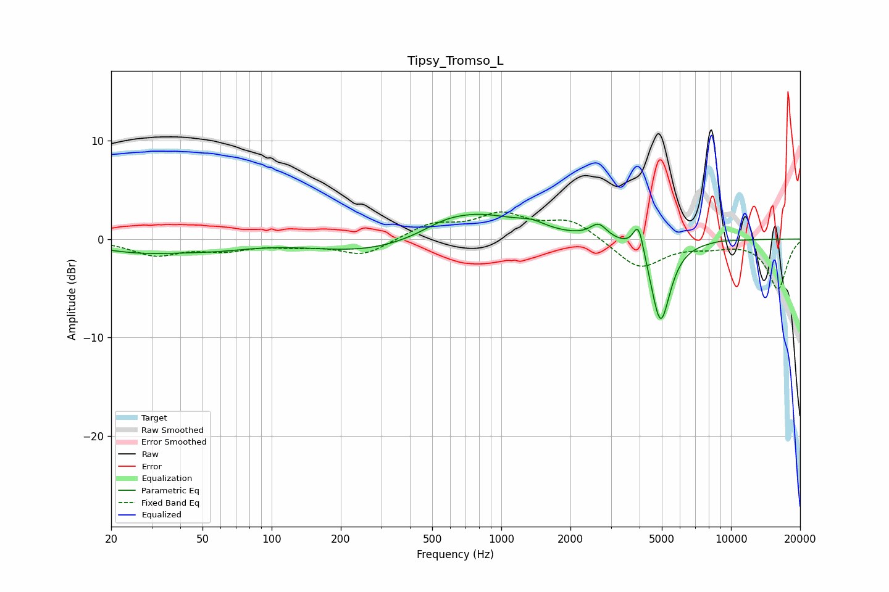

# Tipsy_Tromso_L
See [usage instructions](https://github.com/jaakkopasanen/AutoEq#usage) for more options and info.

### Parametric EQs
Apply preamp of -2.6 dB when using parametric equalizer.

|   # | Type    |   Fc (Hz) |    Q |   Gain (dB) |
|-----|---------|-----------|------|-------------|
|   1 | Peaking |        28 | 0.66 |        -1.3 |
|   2 | Peaking |        58 | 0.93 |        -0.5 |
|   3 | Peaking |       267 | 0.58 |        -1.4 |
|   4 | Peaking |       559 | 1.53 |         0.6 |
|   5 | Peaking |       787 | 0.76 |         2.6 |
|   6 | Peaking |      1357 | 2.38 |         0.6 |
|   7 | Peaking |      2654 | 3.91 |         1.4 |
|   8 | Peaking |      3960 | 5.91 |         3.2 |
|   9 | Peaking |      4937 | 3.25 |        -8.6 |
|  10 | Peaking |      8983 | 4.74 |         0.1 |

### Fixed Band EQs
When using fixed band (also called graphic) equalizer, apply preamp of **-2.8 dB** (if available) and set gains manually with these parameters.

|   # | Type    |   Fc (Hz) |    Q |   Gain (dB) |
|-----|---------|-----------|------|-------------|
|   1 | Peaking |        31 | 1.41 |        -1.6 |
|   2 | Peaking |        62 | 1.41 |        -1   |
|   3 | Peaking |       125 | 1.41 |        -0.5 |
|   4 | Peaking |       250 | 1.41 |        -1.6 |
|   5 | Peaking |       500 | 1.41 |         1.5 |
|   6 | Peaking |      1000 | 1.41 |         2.3 |
|   7 | Peaking |      2000 | 1.41 |         1.9 |
|   8 | Peaking |      4000 | 1.41 |        -3   |
|   9 | Peaking |      8000 | 1.41 |        -0.6 |
|  10 | Peaking |     16000 | 1.41 |        -5   |

### Graphs

