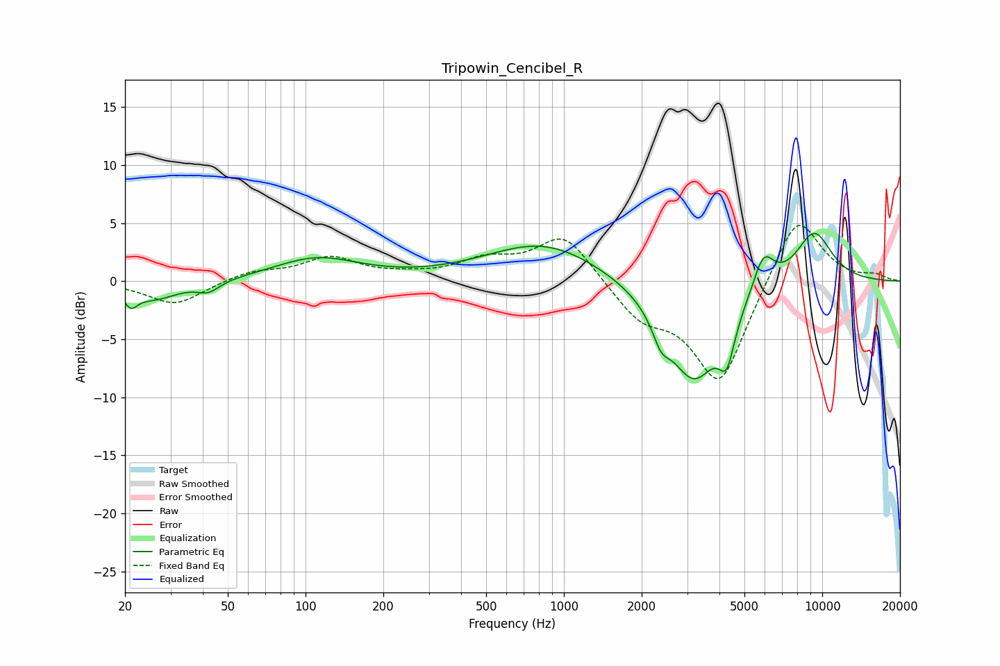

# Tripowin_Cencibel_R
See [usage instructions](https://github.com/jaakkopasanen/AutoEq#usage) for more options and info.

### Parametric EQs
Apply preamp of -4.2 dB when using parametric equalizer.

|   # | Type    |   Fc (Hz) |    Q |   Gain (dB) |
|-----|---------|-----------|------|-------------|
|   1 | Peaking |        21 | 5.76 |        -1.2 |
|   2 | Peaking |        26 | 1.41 |        -1.5 |
|   3 | Peaking |        42 | 3.26 |        -0.9 |
|   4 | Peaking |       110 | 0.86 |         1.9 |
|   5 | Peaking |       836 | 0.64 |         3.4 |
|   6 | Peaking |      2377 | 4.28 |        -1.9 |
|   7 | Peaking |      3176 | 1.32 |        -8.6 |
|   8 | Peaking |      4271 | 4.6  |        -3.6 |
|   9 | Peaking |      5922 | 3.33 |         3.2 |
|  10 | Peaking |      9295 | 1.74 |         4.5 |

### Fixed Band EQs
When using fixed band (also called graphic) equalizer, apply preamp of **-4.9 dB** (if available) and set gains manually with these parameters.

|   # | Type    |   Fc (Hz) |    Q |   Gain (dB) |
|-----|---------|-----------|------|-------------|
|   1 | Peaking |        31 | 1.41 |        -2.1 |
|   2 | Peaking |        62 | 1.41 |         0.8 |
|   3 | Peaking |       125 | 1.41 |         1.9 |
|   4 | Peaking |       250 | 1.41 |         0.3 |
|   5 | Peaking |       500 | 1.41 |         1.6 |
|   6 | Peaking |      1000 | 1.41 |         4.1 |
|   7 | Peaking |      2000 | 1.41 |        -2.9 |
|   8 | Peaking |      4000 | 1.41 |        -8.9 |
|   9 | Peaking |      8000 | 1.41 |         6.2 |
|  10 | Peaking |     16000 | 1.41 |         0.5 |

### Graphs

