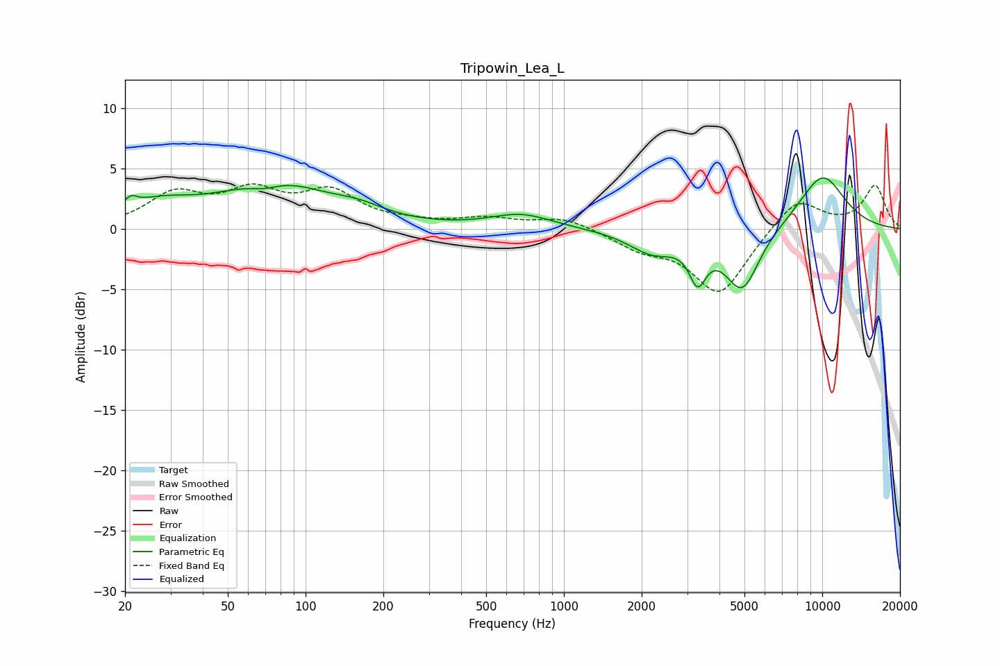

# Tripowin_Lea_L
See [usage instructions](https://github.com/jaakkopasanen/AutoEq#usage) for more options and info.

### Parametric EQs
Apply preamp of -4.3 dB when using parametric equalizer.

|   # | Type    |   Fc (Hz) |    Q |   Gain (dB) |
|-----|---------|-----------|------|-------------|
|   1 | Peaking |        21 | 5.83 |         0.8 |
|   2 | Peaking |        26 | 1.02 |         1.7 |
|   3 | Peaking |        69 | 2.14 |        -0.7 |
|   4 | Peaking |        75 | 0.7  |         3.8 |
|   5 | Peaking |       161 | 1.37 |         0.8 |
|   6 | Peaking |       684 | 1.19 |         1.2 |
|   7 | Peaking |      2204 | 1.51 |        -1.8 |
|   8 | Peaking |      3294 | 4.32 |        -3.2 |
|   9 | Peaking |      4900 | 2.07 |        -5.1 |
|  10 | Peaking |     10000 | 1.3  |         4.6 |

### Fixed Band EQs
When using fixed band (also called graphic) equalizer, apply preamp of **-3.8 dB** (if available) and set gains manually with these parameters.

|   # | Type    |   Fc (Hz) |    Q |   Gain (dB) |
|-----|---------|-----------|------|-------------|
|   1 | Peaking |        31 | 1.41 |         2.7 |
|   2 | Peaking |        62 | 1.41 |         2.7 |
|   3 | Peaking |       125 | 1.41 |         2.8 |
|   4 | Peaking |       250 | 1.41 |         0.4 |
|   5 | Peaking |       500 | 1.41 |         0.8 |
|   6 | Peaking |      1000 | 1.41 |         1   |
|   7 | Peaking |      2000 | 1.41 |        -1.4 |
|   8 | Peaking |      4000 | 1.41 |        -5.4 |
|   9 | Peaking |      8000 | 1.41 |         2.7 |
|  10 | Peaking |     16000 | 1.41 |         3.5 |

### Graphs

