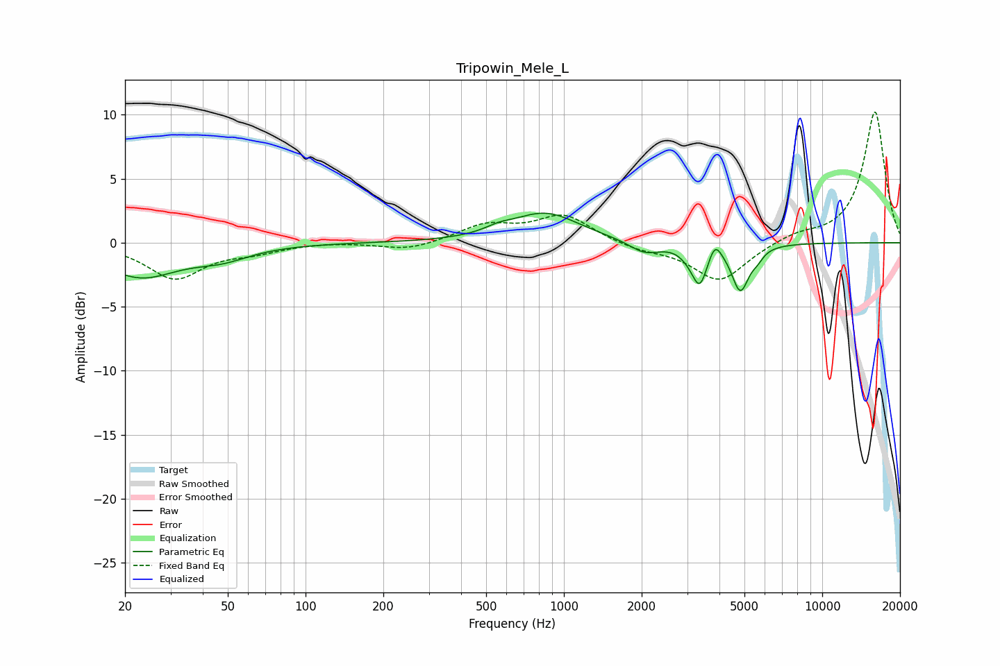

# Tripowin_Mele_L
See [usage instructions](https://github.com/jaakkopasanen/AutoEq#usage) for more options and info.

### Parametric EQs
Apply preamp of -2.4 dB when using parametric equalizer.

|   # | Type    |   Fc (Hz) |    Q |   Gain (dB) |
|-----|---------|-----------|------|-------------|
|   1 | Peaking |        23 | 0.98 |        -2.6 |
|   2 | Peaking |        47 | 1.26 |        -0.9 |
|   3 | Peaking |       558 | 2.71 |         0.4 |
|   4 | Peaking |       846 | 1.07 |         2.3 |
|   5 | Peaking |      2055 | 2.32 |        -1   |
|   6 | Peaking |      3051 | 3.98 |        -0.5 |
|   7 | Peaking |      3357 | 4.84 |        -2.9 |
|   8 | Peaking |      3846 | 5.99 |         1.2 |
|   9 | Peaking |      4820 | 4.23 |        -3.6 |
|  10 | Peaking |      5611 | 5.99 |        -0.6 |

### Fixed Band EQs
When using fixed band (also called graphic) equalizer, apply preamp of **-10.3 dB** (if available) and set gains manually with these parameters.

|   # | Type    |   Fc (Hz) |    Q |   Gain (dB) |
|-----|---------|-----------|------|-------------|
|   1 | Peaking |        31 | 1.41 |        -2.7 |
|   2 | Peaking |        62 | 1.41 |        -0.6 |
|   3 | Peaking |       125 | 1.41 |         0.1 |
|   4 | Peaking |       250 | 1.41 |        -0.6 |
|   5 | Peaking |       500 | 1.41 |         1.3 |
|   6 | Peaking |      1000 | 1.41 |         2.1 |
|   7 | Peaking |      2000 | 1.41 |        -0.5 |
|   8 | Peaking |      4000 | 1.41 |        -3   |
|   9 | Peaking |      8000 | 1.41 |         0.6 |
|  10 | Peaking |     16000 | 1.41 |        10.3 |

### Graphs

