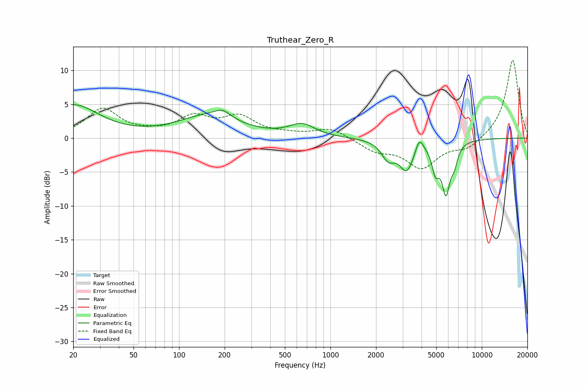

# Truthear_Zero_R
See [usage instructions](https://github.com/jaakkopasanen/AutoEq#usage) for more options and info.

### Parametric EQs
Apply preamp of -5.0 dB when using parametric equalizer.

|   # | Type    |   Fc (Hz) |    Q |   Gain (dB) |
|-----|---------|-----------|------|-------------|
|   1 | Peaking |        20 | 0.83 |         4.8 |
|   2 | Peaking |       156 | 0.71 |         3.1 |
|   3 | Peaking |       194 | 2.73 |         1.1 |
|   4 | Peaking |       650 | 1.65 |         1.8 |
|   5 | Peaking |      2409 | 3.23 |        -2.5 |
|   6 | Peaking |      3188 | 2.93 |        -4.3 |
|   7 | Peaking |      3866 | 5.61 |         2.1 |
|   8 | Peaking |      4946 | 5.78 |        -3.6 |
|   9 | Peaking |      5795 | 5.15 |        -7.1 |
|  10 | Peaking |      6581 | 6    |        -2.3 |

### Fixed Band EQs
When using fixed band (also called graphic) equalizer, apply preamp of **-11.6 dB** (if available) and set gains manually with these parameters.

|   # | Type    |   Fc (Hz) |    Q |   Gain (dB) |
|-----|---------|-----------|------|-------------|
|   1 | Peaking |        31 | 1.41 |         4.2 |
|   2 | Peaking |        62 | 1.41 |         0.4 |
|   3 | Peaking |       125 | 1.41 |         2.8 |
|   4 | Peaking |       250 | 1.41 |         2.9 |
|   5 | Peaking |       500 | 1.41 |         0.4 |
|   6 | Peaking |      1000 | 1.41 |         1.5 |
|   7 | Peaking |      2000 | 1.41 |        -1.7 |
|   8 | Peaking |      4000 | 1.41 |        -4.2 |
|   9 | Peaking |      8000 | 1.41 |        -1.6 |
|  10 | Peaking |     16000 | 1.41 |        11.7 |

### Graphs

